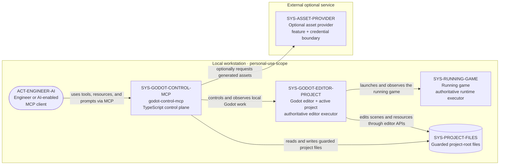

# 01 — System Context

## Purpose

This C4-style context view answers who uses `godot-control-mcp`, which local Godot resources it controls, and where trust changes. The TypeScript server is the control plane, while Godot is the authoritative executor for editor and runtime behavior. The intended deployment is one local workstation for personal use; only the optional asset-provider relationship crosses that boundary.

## Source baseline

- Archive: `C:\Users\dasbl\Downloads\files.zip`
- SHA-256: `0B78D0AC0B0676AEFD31A394ADBB95980B6AC2A6273246840325633CB1F96229`
- Source headings: `00-master-architecture-and-standards.md` — “1. The multi-tier model (core thesis),” “2. The five channels,” “3. System components,” and “6. Cross-cutting standards (apply to every phase)”; `00-competitive-research.md` — “Consolidated synthesis.”

## Context view

## Node outline

| ID | Responsibility | Trust boundary | Phase owner |
|---|---|---|---|
| `ACT-ENGINEER-AI` | Selects and invokes MCP tools, resources, and prompts. | Trusted local user or user-authorized AI client; outside the server process. | Consumer integration |
| `SYS-GODOT-CONTROL-MCP` | Routes requests, applies policy, coordinates adapters, and returns structured outcomes. | Local TypeScript control plane; it does not replace Godot as execution authority. | Phases 1–8 |
| `SYS-GODOT-EDITOR-PROJECT` | Owns editor APIs, scene/resource state, and project-aware execution. | Godot process and active project inside the workstation boundary. | Phases 1–3 |
| `SYS-RUNNING-GAME` | Executes and exposes observable runtime behavior. | Child game process with a constrained runtime bridge. | Phase 5 |
| `SYS-PROJECT-FILES` | Stores project content, imports, UIDs, and generated artifacts. | Canonicalized project-root filesystem guarded by server policy. | Phases 6–7 |
| `SYS-ASSET-PROVIDER` | Optionally generates or supplies assets. | External service reached only when configured and credentialed. | Phase 6 |

## Relationship outline

| ID | Relationship | Source heading | Evidence | Phase owner | Consequence |
|---|---|---|---|---|---|
| `FLOW-CTX-001` | Engineer or AI client → control plane: uses tools, resources, and prompts via MCP. | `00-master-architecture-and-standards.md` — “3. System components” | Explicit | Phases 1 and 8 | MCP remains the sole public control surface. |
| `FLOW-CTX-002` | Control plane → editor/project: controls and observes local Godot work. | `00-master-architecture-and-standards.md` — “1. The multi-tier model (core thesis)” | Explicit | Phases 1–3 | TypeScript coordinates; Godot executes authoritative editor operations. |
| `FLOW-CTX-003` | Editor/project → project files: edits scenes and resources through editor APIs. | `00-master-architecture-and-standards.md` — “1. The multi-tier model (core thesis)” | Explicit | Phases 2–3 | Editor-aware mutation preserves Godot semantics instead of treating resources as arbitrary text. |
| `FLOW-CTX-004` | Editor/project → running game: launches and observes the running game. | `00-master-architecture-and-standards.md` — “2. The five channels” | Explicit | Phase 5 | Runtime control stays local and process-scoped. |
| `FLOW-CTX-005` | Control plane → project files: reads and writes guarded project files. | `00-master-architecture-and-standards.md` — “6. Cross-cutting standards (apply to every phase)” | Explicit | Phases 6–7 | Every path must remain inside an allowed canonical root. |
| `FLOW-CTX-006` | Control plane → asset provider: optionally requests generated assets. | `00-competitive-research.md` — “Consolidated synthesis” | Explicit optional relationship | Phase 6 | External access is feature- and credential-gated and is not required for core operation. |

## Boundary note

Provider transport details are not specified. The provider is an optional external integration, not a sixth local execution channel, and no provider protocol is asserted by this view.
