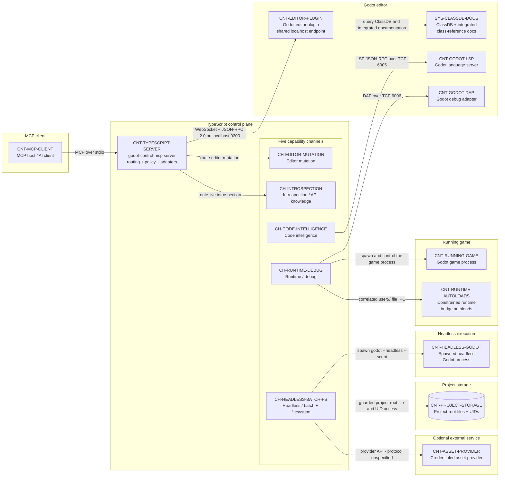

# 02 — Container and Channel Architecture

## Purpose

This primary structural view maps each capability channel to its runtime container and protocol. Exactly five top-level channels live in the TypeScript control plane: Editor mutation, Introspection / API knowledge, Code intelligence, Runtime / debug, and Headless / batch + filesystem. Editor mutation and introspection converge on one editor-plugin WebSocket/JSON-RPC transport; the headless/batch/filesystem channel branches to both spawned Godot processes and guarded project storage.

## Source baseline

- Archive: `C:\Users\dasbl\Downloads\files.zip`
- SHA-256: `0B78D0AC0B0676AEFD31A394ADBB95980B6AC2A6273246840325633CB1F96229`
- Source headings: `00-master-architecture-and-standards.md` — “2. The five channels” and “3. System components”; `phase-01-foundation-and-transport.md`, `phase-02-introspection-and-universal-primitive.md`, `phase-04-code-intelligence-lsp.md`, `phase-05-runtime-and-debug.md`, and `phase-06-batch-filesystem-and-assets.md` — “4. Architecture.”

## Container and channel view

## Container and channel outline

| ID | Responsibility | Boundary | Phase owner |
|---|---|---|---|
| `CNT-MCP-CLIENT` | Discovers and invokes public MCP tools, resources, and prompts. | Consumer process | Consumer integration |
| `CNT-TYPESCRIPT-SERVER` | Owns the MCP surface, routing, policy, safety, adapter lifecycle, and structured results. | Local control-plane process | Phases 1–8 |
| `CH-EDITOR-MUTATION` | Carries universal and curated editor-state mutation. | Server-owned channel | Phases 2–3 |
| `CH-INTROSPECTION` | Carries live scene, project, API, and documentation queries. | Server-owned channel | Phase 2 |
| `CH-CODE-INTELLIGENCE` | Carries script diagnostics, symbols, completion, navigation, and edits. | Server-owned channel | Phase 4 |
| `CH-RUNTIME-DEBUG` | Carries process control, output, DAP, and runtime-bridge operations. | Server-owned channel | Phase 5 |
| `CH-HEADLESS-BATCH-FS` | Carries headless execution, batch, filesystem, UID, export, and asset work. | Server-owned channel | Phase 6 |
| `CNT-EDITOR-PLUGIN` | Exposes the shared local editor mutation/introspection endpoint. | Godot editor process | Phase 1 |
| `SYS-CLASSDB-DOCS` | Supplies authoritative engine API metadata and class-reference text. | Godot editor knowledge surface | Phase 2 |
| `CNT-GODOT-LSP` | Implements Godot language-server protocol behavior. | Godot editor service | Phase 4 |
| `CNT-GODOT-DAP` | Implements Godot debug-adapter protocol behavior. | Godot editor service | Phase 5 |
| `CNT-RUNNING-GAME` | Executes the launched project and emits process output. | Child process | Phase 5 |
| `CNT-RUNTIME-AUTOLOADS` | Performs constrained runtime inspection, input, and capture requests. | Running-game process | Phase 5 |
| `CNT-HEADLESS-GODOT` | Executes isolated headless scripts and batch jobs. | Spawned child process | Phase 6 |
| `CNT-PROJECT-STORAGE` | Stores canonical project-root files and UID-backed resources. | Guarded local filesystem | Phases 6–7 |
| `CNT-ASSET-PROVIDER` | Optionally supplies generated assets when configured. | Credentialed external service | Phase 6 |

## Relationship outline

| ID | Relationship | Source heading | Evidence | Phase owner | Consequence |
|---|---|---|---|---|---|
| `FLOW-CH-001` | MCP client → TypeScript server: MCP over stdio. | `phase-01-foundation-and-transport.md` — “4. Architecture” | Explicit | Phase 1 | Public MCP traffic has one local process entry point. |
| `FLOW-CH-002` | Server → Editor mutation: route editor mutation. | `00-master-architecture-and-standards.md` — “2. The five channels” | Explicit | Phases 2–3 | Editor writes use the editor-aware mutation lane. |
| `FLOW-CH-003` | TypeScript server → plugin: shared editor-channel WebSocket + JSON-RPC 2.0 on `localhost:9200`. | `phase-01-foundation-and-transport.md` — “4. Architecture” | Explicit | Phase 1 | Both editor channels reuse one local plugin transport and lifecycle. |
| `FLOW-CH-004` | Server → Introspection / API knowledge: route live introspection. | `00-master-architecture-and-standards.md` — “2. The five channels” | Explicit | Phase 2 | Live reads enter the same editor-aware control boundary as mutation. |
| `FLOW-CH-005` | Plugin → ClassDB/docs: query ClassDB and integrated documentation. | `phase-02-introspection-and-universal-primitive.md` — “4. Architecture” | Explicit | Phase 2 | API answers remain coupled to the active Godot version. |
| `FLOW-CH-006` | Code intelligence → Godot LSP: LSP JSON-RPC over TCP `6005`. | `phase-04-code-intelligence-lsp.md` — “4. Architecture” | Explicit | Phase 4 | The server adapts Godot LSP rather than reimplementing language intelligence. |
| `FLOW-CH-007` | Runtime / debug → game: spawn and control the game process. | `phase-05-runtime-and-debug.md` — “4. Architecture” | Explicit | Phase 5 | Process ownership provides PID, output, stop, and cleanup control. |
| `FLOW-CH-008` | Runtime / debug → Godot DAP: DAP over TCP `6006`. | `phase-05-runtime-and-debug.md` — “4. Architecture” | Explicit | Phase 5 | Debug features depend on Godot's adapter and may degrade independently. |
| `FLOW-CH-009` | Runtime / debug → runtime autoloads: correlated `user://` file IPC. | `phase-05-runtime-and-debug.md` — “4. Architecture” | Explicit | Phase 5 | Runtime requests and responses require correlation, bounds, and cleanup. |
| `FLOW-CH-010` | Headless / batch + filesystem → headless Godot: spawn `godot --headless --script`. | `phase-06-batch-filesystem-and-assets.md` — “4. Architecture” | Explicit | Phase 6 | Batch execution remains isolated in a bounded child process. |
| `FLOW-CH-011` | Headless / batch + filesystem → project storage: guarded project-root file and UID access. | `phase-06-batch-filesystem-and-assets.md` — “4. Architecture” | Explicit | Phases 6–7 | Canonical path checks constrain direct file operations. |
| `FLOW-CH-012` | Headless / batch + filesystem → asset provider: provider API · protocol unspecified. | `phase-06-batch-filesystem-and-assets.md` — “4. Architecture” | Explicit optional boundary; transport unspecified | Phase 6 | Provider use stays feature- and credential-gated without inventing a wire contract. |

## Protocol notes

- Editor mutation and introspection share WebSocket/JSON-RPC; they are distinct capability channels, not distinct transports.
- Headless, batch, and filesystem work is one top-level channel with separate process-spawn and guarded-file mechanisms.
- The provider protocol is unspecified. The provider edge is explicit and optional, and is unrelated to `Q-012`, which concerns the runtime bridge's local-socket/file-IPC fallback.
