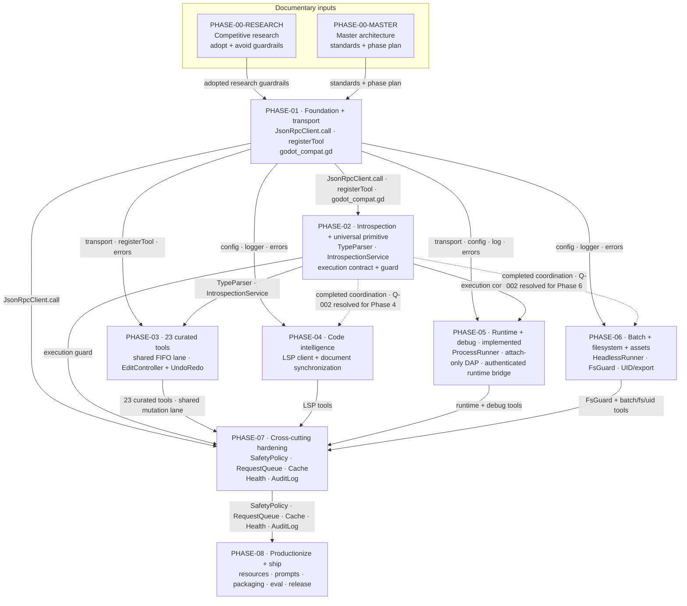

# 03 — Phase Dependencies and Interface Handoffs

## Purpose

This work-order view shows the implementation prerequisites and the contract each phase makes available to later work. Phase 4 resolves its part of [Q-002](open-questions.md#architecture-open-questions): Phase 1 is its solid API prerequisite, while completed Phase 2 is a coordination milestone and regression baseline, not an LSP API dependency. Phase 6 resolves the remaining Q-002 edge the same way via [ADR 0004](../decisions/0004-phase-6-batch-filesystem.md). Phase 5 remains a solid Phase 2 dependency because its own plan explicitly consumes Phase 2 execution.

## Source baseline

- Archive: `C:\Users\dasbl\Downloads\files.zip`
- SHA-256: `0B78D0AC0B0676AEFD31A394ADBB95980B6AC2A6273246840325633CB1F96229`
- Documentary inputs: `00-competitive-research.md` — “Consolidated synthesis”; `00-master-architecture-and-standards.md` — “7. Phase dependency graph.”
- Phase contracts: `phase-01-foundation-and-transport.md` through `phase-08-packaging-resources-prompts-eval-and-production.md` — “1. Objective & Definition of Done,” “3. Dependencies & isolation contract,” and “8. Testing & acceptance criteria.”

## Phase dependency view

## Phase contracts and work-order evidence

| Phase | Objective | Consumes | Produces | Isolation stub | Acceptance evidence |
|---|---|---|---|---|---|
| `PHASE-00-RESEARCH` | Select proven practices and explicit avoid-guardrails from the competitive landscape. | Surveyed Godot MCP implementations and Godot documentation. | Phase-mapped adopted practices, differentiation, and design guardrails. | Documentary input; no runtime stub. | “Consolidated synthesis” records adopted practices by phase and explicit anti-patterns. |
| `PHASE-00-MASTER` | Define the two-tier model, five channels, cross-cutting standards, and ordered phase program. | Competitive synthesis and architecture decisions. | System standards plus the Phase 1–8 dependency graph. | Documentary input; later work may stub contracts named by each phase. | Section 7 states the dependency graph and working-in-isolation rule. |
| `PHASE-01` | Establish MCP/stdio, the Godot WebSocket + JSON-RPC 2.0 bridge, and shared config/log/error foundations. | Nothing; greenfield root. | `JsonRpcClient.call`, `registerTool`, `command_router.gd`, `godot_compat.gd`, config, logger, and errors. | None; this is the root. | JSON-RPC unit tests, headless plugin smoke, live reconnect/version integration, and MCP Inspector probes. |
| `PHASE-02` | Deliver the universal editor-script primitive, live ClassDB/docs introspection, and typed Variant parsing. | Phase 1 `JsonRpcClient`, `registerTool`, errors, config, and log. | Execution contract and guard, shared `TypeParser`, and plugin `IntrospectionService`. | Stub plugin echoes scripts and returns canned ClassDB fixtures. | Parser parity vectors, execution timeout/output/policy cases, live Node introspection/docs, and Tier B authoring regressions. |
| `PHASE-03` | Deliver validated, undoable Tier A editor mutation tools. | Phase 1 transport/registry/errors and queue hook; Phase 2 `TypeParser` and `IntrospectionService`. | Tier A tool suite and plugin `EditController` wrapping mutations in UndoRedo. | Headless scratch project with one fixture scene per tool. | Happy/error paths, exact undo restoration, Tier A scene-build/full-undo flow, and concurrent-mutation serialization. |
| `PHASE-04` | Expose Godot's LSP as project-grounded diagnostics and code-intelligence tools. | Phase 1 LSP-port config, logger, and errors. Phase 2 is a completed coordination/regression milestone, not an API prerequisite. | Implemented reusable `LspClient`, seven LSP tools, and optional owned host. | Mock LSP server replaying recorded TCP 6005 traffic. | Mock framing/handshake/correlation plus live Godot 4.6 diagnostics, completion, native docs, capability honesty, and owned-host teardown. |
| `PHASE-05` | **Implemented:** run, observe, debug, and interact with one controlled game process. | Phase 1 transport/config/log/errors and explicit Phase 2 execution for runtime-bridge injection. | Sole-owner `ProcessRunner`, attach-only `DapClient`, authenticated socket/file runtime bridge, and exactly 13 tools. | Deterministic sample game, unit/inventory coverage, real DAP/runtime flows, and aggregate Godot smoke. | Exact 51-tool inventory; output/stop, bridge state/input/verified screenshot, breakpoint/inspect/step, and exact-child teardown. |
| `PHASE-06` | **Implemented:** headless batch, guarded project-file, UID list, export, and optional asset seam. | Phase 1 Godot-path/project config, logger, and errors (Phase 2 coordination only; [ADR 0004](../decisions/0004-phase-6-batch-filesystem.md)). | `HeadlessRunner`, `FsGuard`, seven public tools, export roots policy, disabled-by-default asset provider. | Godot binary plus scratch project; provider remains behind an interface. | FsGuard escape denial, headless mock/live, export root jail, UID list, inventory 58, asset `feature_disabled`. |
| `PHASE-07` | **Implemented:** apply safety, concurrency, caching, health, and audit uniformly. | Every phase's tools plus registry middleware ([ADR 0005](../decisions/0005-phase-7-hardening.md)). | Registry policy band: mode gate, shared `MutationLane`, `ReadCache` with generation fence, `AuditLog`, `HealthService`. | Middleware unit tests against the existing tool set. | Mode/confirmation matrix, serialized mutations, cache fence, audit on block/success, Q-004–Q-008 resolved. |
| `PHASE-08` | **Implemented:** production resources, prompts, packaging, eval, and support matrix. | Every prior phase, especially Phase 7 health and safety ([ADR 0006](../decisions/0006-phase-8-production.md)). | `godot://` resources, `add-feature-to-scene` prompt, package `bin` entry, eval suite, reconnect acceptance constant. | Read-only discovery without Godot; live tools remain existing phase suites. | Resource/prompt discovery, eval suite green, Node `>=22`, Godot 4.6-only matrix, 65s reconnect window. |

## Dependency interpretation

- Phases 3–6 are presented as one parallel work rank. Their isolation stubs allow implementation work to begin without every live dependency, but acceptance still requires the named integration evidence.
- `FLOW-PH-007` records the accepted Phase 4 resolution: completed Phase 2 coordinated integration and regression coverage but is not an LSP API prerequisite. `FLOW-PH-011` is resolved for Phase 6 by [ADR 0004](../decisions/0004-phase-6-batch-filesystem.md): Phase 1 is the API prerequisite; Phase 2 remains coordination/regression only (diagram edge may still show historical dotted form until SVG regeneration).
- `FLOW-PH-009` is solid: unlike the Phase 4 and Phase 6 headers, the Phase 5 plan explicitly consumes Phase 2 execution for runtime-bridge injection and expression evaluation.
- Phase 7 is the convergence gate for all implemented channels; Phase 8 productionizes the hardened system.
