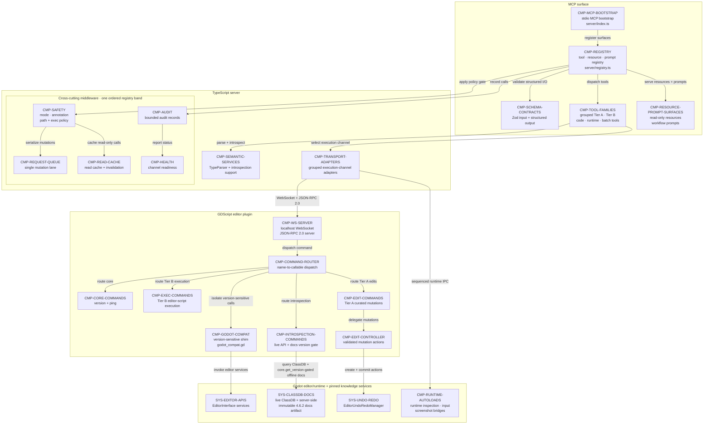

# 04 — Server and Plugin Components

## Purpose

This component view assigns MCP registration, shared policy, semantic support, execution adapters, plugin dispatch, and Godot-version coupling to concrete code boundaries. It keeps the GDScript plugin thin: stable coordination remains in the TypeScript server, while editor-authoritative and version-sensitive behavior remains in Godot.

## Source baseline

- Archive: `C:\Users\dasbl\Downloads\files.zip`
- SHA-256: `0B78D0AC0B0676AEFD31A394ADBB95980B6AC2A6273246840325633CB1F96229`
- System boundaries: `00-master-architecture-and-standards.md` — “3. System components,” “4. Tech stack (decisions),” and “5. The version-coupling principle (critical constraint).”
- Component layouts: `phase-01-foundation-and-transport.md` through `phase-07-hardening-safety-concurrency-observability.md` — “4. Architecture.”
- MCP resources and prompts: `phase-08-packaging-resources-prompts-eval-and-production.md` — “4. Architecture.”

## Component view

## Grouped tool-family outline

| Family | Responsibility | Planned server boundary |
|---|---|---|
| Tier A curated editing | Validated scene, node, signal, resource, and project mutations. | `tools/scene.ts`, `tools/node.ts`, `tools/signal.ts`, `tools/resource.ts`, and `tools/project.ts` |
| Tier B universal primitive | Guarded editor-script execution plus live API and project introspection. | `tools/script.ts`, `tools/introspection.ts`, `util/type-parser.ts`, and `exec/guard.ts` |
| Code intelligence | LSP diagnostics, completion, symbols, navigation, documentation, and document synchronization. | `tools/lsp.ts` backed by `lsp/client.ts` and optional `lsp/host.ts` |
| Runtime and debug | Child-process lifecycle, output, DAP sessions, and running-game bridge operations. | `runtime/process.ts`, `runtime/dap-client.ts`, and the sequenced runtime IPC driver |
| Batch, filesystem, UID/export, and assets | Headless scripts, import/export, guarded project files, UID work, and optional generation. | `batch/headless.ts`, `batch/export.ts`, `fs/guard.ts`, `fs/tools.ts`, `uid/tools.ts`, and optional `assets/provider.ts` |

## Grouped adapter outline

| Adapter | Mechanism | Planned boundary and ownership |
|---|---|---|
| WebSocket bridge | Local WebSocket plus JSON-RPC 2.0, default port 9200. | `bridge/ws-client.ts` talks to plugin `ws_server.gd`; the plugin remains the editor executor. |
| LSP | Godot LSP JSON-RPC over TCP 6005 with document lifecycle. | `lsp/client.ts`; optional `lsp/host.ts` launches or attaches the editor language server. |
| ProcessRunner | Controlled Godot child process with bounded output and teardown. | `runtime/process.ts` owns launch, capture, stop, and cleanup. |
| DAP | Godot Debug Adapter Protocol over TCP 6006. | `runtime/dap-client.ts` owns request correlation and debug-session state. |
| runtime IPC | Sequenced `user://` request and response files with IDs, timeouts, bounds, and cleanup. | The TypeScript driver addresses `MCPRuntimeBridge`, `MCPInputBridge`, and `MCPScreenshotBridge` autoloads. |
| HeadlessRunner | Temporary script plus `godot --headless --script`, with capture and cleanup. | `batch/headless.ts` owns the process mechanism. |
| FsGuard | Canonical path resolution jailed to configured project roots. | `fs/guard.ts` gates `fs/tools.ts`, UID work, export destinations, and asset placement. |
| UID/export | Project UID maintenance and bounded Godot export invocations. | `uid/tools.ts` and `batch/export.ts` remain behind the guarded batch/filesystem channel. |
| optional AssetProvider | Feature-gated provider interface; transport and credentials stay provider-specific. | `assets/provider.ts` defaults to no-op; `assets/meshy.ts` is an optional implementation. |

## Boundary interpretation

- `server/registry.ts` is the only assembly point for schemas, surfaces, and Phase 7 middleware. Individual tool families do not bypass that band.
- `addons/godot_control_mcp/command_router.gd` dispatches only the four command groups shown. `commands/edit.gd` delegates all mutation mechanics to `edit_controller.gd` and `EditorUndoRedoManager`.
- `addons/godot_control_mcp/godot_compat.gd` is the sole version-sensitive compatibility boundary before `EditorInterface` services. The TypeScript server remains stable across supported Godot minors.
- The runtime autoload route is drawn directly from the grouped adapter node because the source defines a separate running-game mechanism; it does not imply an extra command-router connector.
