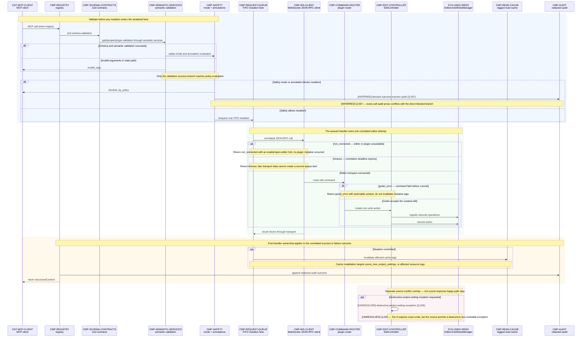

# 05 — Curated Editor Mutation Sequence

## Purpose

This behavioral view defines how one Tier A mutation becomes a validated, serialized, undoable Godot editor change. The registry owns the public MCP boundary, semantic services validate Godot-specific arguments, Phase 7 middleware owns policy and serialization, and the editor plugin remains the authoritative executor. The numbered messages are normative and appear in their required order; alternative bands show which owner terminates or records each failure.

## Source baseline

- Archive: `C:\Users\dasbl\Downloads\files.zip`
- SHA-256: `0B78D0AC0B0676AEFD31A394ADBB95980B6AC2A6273246840325633CB1F96229`
- Source headings: `phase-01-foundation-and-transport.md` — “3. Dependencies & isolation contract,” “4. Architecture,” and “7. Implementation notes”; `phase-02-introspection-and-universal-primitive.md` — “3. Dependencies & isolation contract,” “4. Architecture,” and “5. Design decisions (with rationale)”; `phase-03-curated-editor-mutation-tier.md` — “1. Objective & Definition of Done,” “3. Dependencies & isolation contract,” “4. Architecture,” “6. Development plan (ordered),” “7. Implementation notes,” and “9. Risks & mitigations”; `phase-07-hardening-safety-concurrency-observability.md` — “2. Scope,” “4. Architecture,” “5. Design decisions (with rationale),” “6. Development plan (ordered),” and “7. Implementation notes.”

## Normative Tier A sequence

## Failure ownership and consequences

| Outcome | Owner | Mutation and cache consequence | Audit and client consequence |
|---|---|---|---|
| `invalid_args` | Zod contracts or semantic validation | Stops before the FIFO lane; no editor call and no cache invalidation. | Returns an actionable argument/path/property/type error. Rejected-call audit coverage remains subject to `Q-007`. |
| `blocked_by_policy` | Safety middleware | Stops before the FIFO lane; no editor call and no cache invalidation. | The blocked outcome reaching audit is **[INFERRED]** from the every-call requirement and tracked by `Q-007`. |
| `not_connected` | WebSocket client | The queued attempt cannot dispatch; no Godot change and no cache invalidation. | Returns an editor/plugin setup hint, then records the bounded outcome. |
| `timeout` | WebSocket client and request queue | The correlated attempt expires without creating another mutation item; cache tags remain unchanged unless a commit was confirmed. | Returns the stable timeout error and audits the bounded outcome. |
| `godot_error` | Plugin router or edit controller | No cache invalidation occurs when the command fails before commit. | Returns actionable Godot context and appends a redacted outcome. |
| committed mutation | Edit controller and `EditorUndoRedoManager` | Exactly one action commits; affected read-cache tags are invalidated. | Registry appends the redacted outcome and returns `structuredContent`. |

## Interpretation constraints

- One policy-approved Tier A write occupies one FIFO mutation item and issues one correlated JSON-RPC call. Retries, if any, are a caller decision and cannot silently duplicate the editor action.
- A successful curated edit creates one named undo action, registers paired do/undo operations, and commits once before cache invalidation.
- The final red band is a documentary exception overlay, not a continuation after the client response. `FLOW-MUT-018` is **[UNRESOLVED]** under `Q-005`: the source simultaneously requires every Tier A mutation to be exactly undoable and permits a destructive project-setting exception.
- Evidence status is carried in message and note text. Sequence arrows retain their ordinary call/response meaning.
