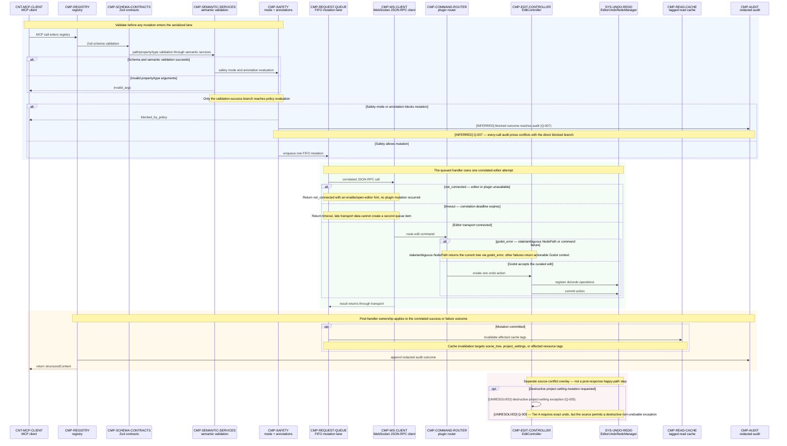

# 05 — Curated Editor Mutation Sequence

## Purpose

This behavioral view defines how one Tier A mutation becomes a validated, serialized, undoable Godot editor change. The registry owns the public MCP boundary, semantic services validate Godot-specific arguments, Phase 7 middleware owns policy and serialization, and the editor plugin remains the authoritative executor. The numbered messages are normative and appear in their required order; alternative bands show which owner terminates or records each failure.

## Source baseline

- Archive: `C:\Users\dasbl\Downloads\files.zip`
- SHA-256: `0B78D0AC0B0676AEFD31A394ADBB95980B6AC2A6273246840325633CB1F96229`
- Source headings: `phase-01-foundation-and-transport.md` — “3. Dependencies & isolation contract,” “4. Architecture,” and “7. Implementation notes”; `phase-02-introspection-and-universal-primitive.md` — “3. Dependencies & isolation contract,” “4. Architecture,” and “5. Design decisions (with rationale)”; `phase-03-curated-editor-mutation-tier.md` — “1. Objective & Definition of Done,” “3. Dependencies & isolation contract,” “4. Architecture,” “6. Development plan (ordered),” “7. Implementation notes,” and “9. Risks & mitigations”; `phase-07-hardening-safety-concurrency-observability.md` — “2. Scope,” “4. Architecture,” “5. Design decisions (with rationale),” “6. Development plan (ordered),” and “7. Implementation notes.”

## Normative Tier A sequence

## Participant outline

The participants below are indexed in the [Traceability index](traceability.md#architecture-atlas-traceability). Source conflicts remain in the [Open-question register](open-questions.md#architecture-open-questions), including [Q-005](open-questions.md#architecture-open-questions) and [Q-007](open-questions.md#architecture-open-questions).

| Participant | Responsibility | Phase owner | Protocol / boundary |
|---|---|---|---|
| `CNT-MCP-CLIENT` | Invokes the curated tool and receives structured results. | Consumer integration | MCP over stdio; public client boundary. |
| `CMP-REGISTRY` | Owns registration, middleware composition, audit finalization, and response mapping. | Phases 1 and 7 | TypeScript MCP registry boundary. |
| `CMP-SCHEMA-CONTRACTS` | Applies Zod input and structured-output contracts. | Phases 1 and 3 | In-process TypeScript schema boundary. |
| `CMP-SEMANTIC-SERVICES` | Validates property/type semantics and parses Variant values before policy. | Phases 2 and 3 | TypeParser and introspection-service boundary. |
| `CMP-SAFETY` | Evaluates mode and destructive annotations. | Phase 7 | Registry middleware policy boundary. |
| `CMP-REQUEST-QUEUE` | Serializes one approved Tier A mutation at a time. | Phase 7 | TypeScript FIFO mutation lane. |
| `CMP-WS-CLIENT` | Correlates plugin JSON-RPC calls and owns connection/timeout errors. | Phase 1 | Local WebSocket JSON-RPC client boundary. |
| `CMP-COMMAND-ROUTER` | Dispatches the routed plugin edit command. | Phases 1 and 3 | GDScript plugin JSON-RPC dispatch boundary. |
| `CMP-EDIT-CONTROLLER` | Creates the action and records the curated edit mechanics. | Phase 3 | GDScript `EditController` boundary. |
| `SYS-UNDO-REDO` | Registers and commits paired editor do/undo operations. | Phase 3 | Godot `EditorUndoRedoManager` service boundary. |
| `CMP-READ-CACHE` | Invalidates read tags only after confirmed mutation commit. | Phase 7 | Tagged TypeScript cache middleware. |
| `CMP-AUDIT` | Appends bounded, redacted tool outcomes. | Phase 7 | Audit sink on stderr/file, never MCP stdout. |

## Relationship outline

| Flow | From → To | Message / outcome | Evidence | Phase / protocol | Source / trace |
|---|---|---|---|---|---|
| `FLOW-MUT-001` | `CNT-MCP-CLIENT` → `CMP-REGISTRY` | MCP call enters registry. | Explicit | Phase 1 / MCP over stdio | Phase 1 §4 · [trace](traceability.md#architecture-atlas-traceability) |
| `FLOW-MUT-002` | `CMP-REGISTRY` → `CMP-SCHEMA-CONTRACTS` | Zod schema validation. | Explicit | Phases 1 and 3 / Zod in process | Phase 1 §3; Phase 3 §4 · [trace](traceability.md#architecture-atlas-traceability) |
| `FLOW-MUT-003` | `CMP-SCHEMA-CONTRACTS` → `CMP-SEMANTIC-SERVICES` | Property/type and path-syntax semantic validation. | Explicit | Phases 2 and 3 / TypeParser and introspection | Phase 2 §3; Phase 3 §§4,7 · [trace](traceability.md#architecture-atlas-traceability) |
| `FLOW-MUT-004` | `CMP-SEMANTIC-SERVICES` → `CMP-SAFETY` | Safety mode and annotation evaluation. | Explicit | Phase 7 / registry middleware | Phase 7 §§4–5 · [trace](traceability.md#architecture-atlas-traceability) |
| `FLOW-MUT-005` | `CMP-SEMANTIC-SERVICES` → `CNT-MCP-CLIENT` | `invalid_args` for property/type mismatch. | Explicit | Phases 3 and 7 / structured MCP error | Phase 3 §§7–8; Phase 7 §2 · [trace](traceability.md#architecture-atlas-traceability) |
| `FLOW-MUT-006` | `CMP-SAFETY` → `CNT-MCP-CLIENT` | `blocked_by_policy`. | Explicit | Phase 7 / structured MCP error | Phase 7 §§4,7 · [trace](traceability.md#architecture-atlas-traceability) |
| `FLOW-MUT-007` | `CMP-SAFETY` → `CMP-AUDIT` | Blocked outcome reaches audit. | Inferred | Phase 7 / audit middleware | Phase 7 §§4–5 · [Q-007](open-questions.md#architecture-open-questions) · [trace](traceability.md#architecture-atlas-traceability) |
| `FLOW-MUT-008` | `CMP-SAFETY` → `CMP-REQUEST-QUEUE` | Enqueue one FIFO mutation. | Explicit | Phase 7 / FIFO mutation lane | Phase 7 §§5–7 · [trace](traceability.md#architecture-atlas-traceability) |
| `FLOW-MUT-009` | `CMP-REQUEST-QUEUE` → `CMP-WS-CLIENT` | Correlated JSON-RPC call. | Explicit | Phase 1 / WebSocket JSON-RPC 2.0 | Phase 1 §§3–6 · [trace](traceability.md#architecture-atlas-traceability) |
| `FLOW-MUT-010` | `CMP-WS-CLIENT` → `CMP-COMMAND-ROUTER` | Route edit command. | Explicit | Phases 1 and 3 / plugin JSON-RPC dispatch | Phase 1 §§3–4; Phase 3 §4 · [trace](traceability.md#architecture-atlas-traceability) |
| `FLOW-MUT-011` | `CMP-COMMAND-ROUTER` → `CMP-EDIT-CONTROLLER` | Create one undo action. | Explicit | Phase 3 / GDScript plugin call | Phase 3 §4 · [trace](traceability.md#architecture-atlas-traceability) |
| `FLOW-MUT-012` | `CMP-EDIT-CONTROLLER` → `SYS-UNDO-REDO` | Register paired do/undo operations. | Explicit | Phase 3 / EditorUndoRedoManager API | Phase 3 §4 · [trace](traceability.md#architecture-atlas-traceability) |
| `FLOW-MUT-013` | `CMP-EDIT-CONTROLLER` → `SYS-UNDO-REDO` | Commit the one action. | Explicit | Phase 3 / EditorUndoRedoManager API | Phase 3 §§1,4 · [trace](traceability.md#architecture-atlas-traceability) |
| `FLOW-MUT-014` | `CMP-WS-CLIENT` → `CMP-REQUEST-QUEUE` | Result or `not_connected`, `timeout`, or `godot_error` — stale/ambiguous NodePath includes current tree. | Explicit | Phases 1 and 3 / correlated JSON-RPC result | Phase 1 §§4,7–9; Phase 3 §9 · [trace](traceability.md#architecture-atlas-traceability) |
| `FLOW-MUT-015` | `CMP-REQUEST-QUEUE` → `CMP-READ-CACHE` | Invalidate affected cache tags after commit. | Explicit | Phases 3 and 7 / tagged cache invalidation | Phase 3 §§6,10; Phase 7 §§4,7 · [trace](traceability.md#architecture-atlas-traceability) |
| `FLOW-MUT-016` | `CMP-REGISTRY` → `CMP-AUDIT` | Append redacted audit outcome. | Explicit | Phase 7 / audit middleware | Phase 7 §§4–6 · [trace](traceability.md#architecture-atlas-traceability) |
| `FLOW-MUT-017` | `CMP-REGISTRY` → `CNT-MCP-CLIENT` | Return `structuredContent`. | Explicit | Phases 1 and 3 / MCP structured result | Phase 1 §4; Phase 3 §4 · [trace](traceability.md#architecture-atlas-traceability) |
| `FLOW-MUT-018` | `CMP-EDIT-CONTROLLER` → `CMP-EDIT-CONTROLLER` | Destructive project-setting exception. | Unresolved | Phase 3 / Tier A undo contract | Phase 3 §§1,2,5,6,9 · [Q-005](open-questions.md#architecture-open-questions) · [trace](traceability.md#architecture-atlas-traceability) |

## Failure ownership and consequences

| Outcome | Owner | Mutation and cache consequence | Audit and client consequence |
|---|---|---|---|
| `invalid_args` | Zod contracts or semantic validation | Stops before the FIFO lane; no editor call and no cache invalidation. | Returns an actionable schema, property, or type error. Rejected-call audit coverage remains subject to `Q-007`. |
| `blocked_by_policy` | Safety middleware | Stops before the FIFO lane; no editor call and no cache invalidation. | The blocked outcome reaching audit is **[INFERRED]** from the every-call requirement and tracked by `Q-007`. |
| `not_connected` | WebSocket client | The queued attempt cannot dispatch; no Godot change and no cache invalidation. | Returns an editor/plugin setup hint, then records the bounded outcome. |
| `timeout` | WebSocket client and request queue | The correlated attempt expires without creating another mutation item; cache tags remain unchanged unless a commit was confirmed. | Returns the stable timeout error and audits the bounded outcome. |
| `godot_error` | Plugin router or edit controller | Stale/ambiguous `NodePath` resolution or another command failure occurs after routing; no cache invalidation occurs before commit. | Returns actionable Godot context, including the current tree on a NodePath miss, and appends a redacted outcome. |
| committed mutation | Edit controller and `EditorUndoRedoManager` | Exactly one action commits; affected read-cache tags are invalidated. | Registry appends the redacted outcome and returns `structuredContent`. |

## Interpretation constraints

- One policy-approved Tier A write occupies one FIFO mutation item and issues one correlated JSON-RPC call. Retries, if any, are a caller decision and cannot silently duplicate the editor action.
- A successful curated edit creates one named undo action, registers paired do/undo operations, and commits once before cache invalidation.
- The final red band is a documentary exception overlay, not a continuation after the client response. `FLOW-MUT-018` is **[UNRESOLVED]** under `Q-005`: the source simultaneously requires every Tier A mutation to be exactly undoable and permits a destructive project-setting exception.
- Evidence status is carried in message and note text. Sequence arrows retain their ordinary call/response meaning.
