# 06 — Runtime, DAP, and Bridge Sequence

## Purpose

This implemented behavioral view connects Phase 5's managed game-process control/output, attach-only DAP debugging, and authenticated running-game bridge. The numbered messages show sole process ownership, pre-request transport locking, no replay, stopped-reference invalidation, and exact-child cleanup.

## Source baseline

- Archive: `C:\Users\dasbl\Downloads\files.zip`
- SHA-256: `0B78D0AC0B0676AEFD31A394ADBB95980B6AC2A6273246840325633CB1F96229`
- Source headings: `phase-05-runtime-and-debug.md` — “1. Objective & Definition of Done,” “2. Scope,” “3. Dependencies & isolation contract,” “4. Architecture,” “5. Design decisions (with rationale),” “6. Development plan (ordered),” “7. Implementation notes,” “8. Testing & acceptance criteria,” “9. Risks & mitigations,” and “10. Deliverables”; `phase-02-introspection-and-universal-primitive.md` — “3. Dependencies & isolation contract” for the consumed execution seam; `phase-07-hardening-safety-concurrency-observability.md` — “4. Architecture” for the audit boundary.

## Normative runtime sequence

```mermaid
%%{init: {"sequence": {"width": 190, "actorMargin": 50}}}%%
sequenceDiagram
  accTitle: Runtime process, DAP, and running-game bridge lifecycle
  accDescr: Setup uses ProcessRunner as sole process owner, authenticates and locks the runtime transport before requests, and attaches DAP without spawning. Interaction uses bounded cursors and stopped-generation references with no replay. Shutdown closes DAP, bridge, and the exact child while preserving the first failure.

  %% atlas-node: CNT-MCP-CLIENT
  participant MCP_CLIENT as CNT-MCP-CLIENT<br/>MCP client
  %% atlas-node: CMP-RUNTIME-TOOLS
  participant RUNTIME_TOOLS as CMP-RUNTIME-TOOLS<br/>runtime + debug tools
  %% atlas-node: CMP-PROCESS-RUNNER
  participant PROCESS_RUNNER as CMP-PROCESS-RUNNER<br/>ProcessRunner
  %% atlas-node: CNT-RUNNING-GAME
  participant RUNNING_GAME as CNT-RUNNING-GAME<br/>running game
  %% atlas-node: CMP-DAP-CLIENT
  participant DAP_CLIENT as CMP-DAP-CLIENT<br/>DapClient
  %% atlas-node: CNT-GODOT-DAP
  participant GODOT_DAP as CNT-GODOT-DAP<br/>Godot DAP
  %% atlas-node: CMP-RUNTIME-DRIVER
  participant RUNTIME_DRIVER as CMP-RUNTIME-DRIVER<br/>runtime driver
  %% atlas-node: CMP-RUNTIME-AUTOLOADS
  participant AUTOLOADS as CMP-RUNTIME-AUTOLOADS<br/>runtime autoloads
  %% atlas-node: CNT-RUNTIME-IPC-FILES
  participant IPC_FILES as CNT-RUNTIME-IPC-FILES<br/>user runtime IPC files
  %% atlas-node: CMP-AUDIT
  participant AUDIT as CMP-AUDIT<br/>redacted audit

  rect rgb(239, 247, 255)
    Note over MCP_CLIENT,RUNTIME_DRIVER: SETUP — start the game, expose output, and establish the source-defined DAP and bridge capabilities
    %% atlas-flow: FLOW-RUN-001
    MCP_CLIENT->>RUNTIME_TOOLS: godot_run_project
    %% atlas-flow: FLOW-RUN-002
    PROCESS_RUNNER->>RUNNING_GAME: spawn godot --path <project> [scene]
    %% atlas-flow: FLOW-RUN-003
    RUNNING_GAME-->>PROCESS_RUNNER: stream stdout/stderr into ring buffer
    %% atlas-flow: FLOW-RUN-004
    MCP_CLIENT->>RUNTIME_TOOLS: incremental output using since/next
    Note over MCP_CLIENT,PROCESS_RUNNER: The since cursor selects unread ring-buffer lines, and next is the continuation cursor
    %% atlas-flow: FLOW-RUN-005
    RUNTIME_TOOLS->>DAP_CLIENT: initialize attach-only DAP
    alt Debug session proceeds
      %% atlas-flow: FLOW-RUN-006
      DAP_CLIENT->>GODOT_DAP: attach to ProcessRunner-owned exact child (Q-010 accepted)
      Note over PROCESS_RUNNER,GODOT_DAP: ProcessRunner is sole spawn, PID, and output owner, while DAP never spawns
    else DAP support is partial or unavailable
      Note over PROCESS_RUNNER,RUNTIME_DRIVER: Explicitly degrade to process + bridge — process control and the runtime bridge remain usable
    end
    %% atlas-flow: FLOW-RUN-007
    RUNTIME_TOOLS->>RUNTIME_DRIVER: plugin resolves canonical user:// root and injects bridge
  end

  rect rgb(243, 252, 246)
    Note over MCP_CLIENT,IPC_FILES: INTERACTION — correlate one live inspect, input, or screenshot request through the source-defined file discipline
    %% atlas-flow: FLOW-RUN-008
    MCP_CLIENT->>RUNTIME_TOOLS: runtime inspect/input/screenshot request
    %% atlas-flow: FLOW-RUN-009
    RUNTIME_TOOLS->>RUNTIME_DRIVER: allocate ID after authenticated transport lock
    Note over RUNTIME_DRIVER,IPC_FILES: Q-011 accepted — Godot publishes the canonical session root and Node never guesses user://
    Note over RUNTIME_DRIVER,AUTOLOADS: Q-012 accepted — pre-request mutual authentication locks socket or file, with no switch or replay after publication
    %% atlas-flow: FLOW-RUN-010
    RUNTIME_DRIVER->>IPC_FILES: file fallback atomically writes req-<id>.json
    %% atlas-flow: FLOW-RUN-011
    AUTOLOADS->>IPC_FILES: autoload polls and reads request
    %% atlas-flow: FLOW-RUN-012
    AUTOLOADS->>RUNNING_GAME: execute requested operation
    %% atlas-flow: FLOW-RUN-013
    AUTOLOADS->>IPC_FILES: write correlated response file
    Note over RUNTIME_DRIVER,IPC_FILES: exact user://.mcp/<sessionId>/resp-<id>.json
    alt Response file appears before the per-request timeout
      %% atlas-flow: FLOW-RUN-014
      RUNTIME_DRIVER->>IPC_FILES: server reads and deletes response
      %% atlas-flow: FLOW-RUN-015
      RUNTIME_TOOLS-->>MCP_CLIENT: return structured result
    else Response deadline expires
      %% atlas-flow: FLOW-RUN-016
      RUNTIME_TOOLS-->>MCP_CLIENT: timeout alternative with game-not-running hint
    end
    opt Successful IPC response and requested operation is a screenshot
      %% atlas-flow: FLOW-RUN-017
      RUNTIME_TOOLS-->>MCP_CLIENT: return verified path, dimensions, bytes, SHA-256, and PNG
      Note over RUNTIME_TOOLS,MCP_CLIENT: Canonical path containment, signature, IHDR, size, and hash are verified before success
    end
  end

  rect rgb(255, 247, 235)
    Note over RUNTIME_TOOLS,AUDIT: SHUTDOWN — stop the process, clean bridge and debug state, then record the terminal outcome
    %% atlas-flow: FLOW-RUN-018
    RUNTIME_TOOLS->>PROCESS_RUNNER: graceful stop, then force if required
    Note over PROCESS_RUNNER,RUNNING_GAME: Graceful termination is attempted first, and forced stop is the required fallback
    %% atlas-flow: FLOW-RUN-019
    RUNTIME_TOOLS->>RUNTIME_TOOLS: close DAP, close bridge, stop exact ProcessRunner child
    Note over PROCESS_RUNNER,IPC_FILES: Preserve first failure and retain unconfirmed exact-child ownership for retry
    %% atlas-flow: FLOW-RUN-020
    RUNTIME_TOOLS->>AUDIT: audit outcome
  end
```

## Participant outline

The participants below are indexed in the [Traceability index](traceability.md#architecture-atlas-traceability). Accepted decisions are recorded in the [Open-question register](open-questions.md#architecture-open-questions): [Q-010](open-questions.md#architecture-open-questions), [Q-011](open-questions.md#architecture-open-questions), and [Q-012](open-questions.md#architecture-open-questions).

| Participant | Responsibility | Phase owner | Protocol / boundary |
|---|---|---|---|
| `CNT-MCP-CLIENT` | Invokes runtime, output, debug, bridge, and stop tools and receives structured results. | Consumer integration | MCP over stdio; public client boundary. |
| `CMP-RUNTIME-TOOLS` | Maps public tool calls to process, DAP, runtime-driver, cleanup, and audit behavior. | Phase 5 | In-process TypeScript tool boundary. |
| `CMP-PROCESS-RUNNER` | Sole owner of OS spawn, PID tracking, ring-buffer output, graceful/forced stop, and exact-child cleanup. | Phase 5 | Local child-process boundary. |
| `CNT-RUNNING-GAME` | Executes the launched project, emits output, and supplies the live runtime state acted on by autoloads. | Phase 5 | Godot game-process boundary. |
| `CMP-DAP-CLIENT` | Implements attach-only DAP framing, capabilities, stopped-generation invalidation, and teardown; no spawn or evaluate. | Phase 5 | DAP client boundary to Godot's debug adapter. |
| `CNT-GODOT-DAP` | Serves supported debug state, breakpoint, stack, scope, variable, and execution requests. | Phase 5 | Godot DAP endpoint boundary. |
| `CMP-RUNTIME-DRIVER` | Authenticates through `hello`/`hello_ack`/`hello_confirm`/`hello_ready` and locks socket/file transport before requests, applies deadlines and bounds, and never replays. | Phase 5 | TypeScript runtime-bridge boundary. |
| `CMP-RUNTIME-AUTOLOADS` | Polls requests inside the running game, performs inspect/input/capture operations, and writes responses. | Phase 5 | Injected GDScript autoload boundary. |
| `CNT-RUNTIME-IPC-FILES` | Holds exact request, response, bootstrap, and screenshot artifacts under the Godot-resolved canonical session root. | Phase 5 | Sequenced `user://.mcp/<sessionId>` fallback boundary. |
| `CMP-AUDIT` | Records the bounded runtime/debug terminal outcome without using MCP stdout. | Phase 7 | Audit middleware sink boundary. |

## Relationship outline

| Flow | From → To | Message / outcome | Evidence | Phase / protocol | Source / trace |
|---|---|---|---|---|---|
| `FLOW-RUN-001` | `CNT-MCP-CLIENT` → `CMP-RUNTIME-TOOLS` | Invoke `godot_run_project`. | Explicit | Phase 5 / MCP tool dispatch | Phase 5 §2 · [trace](traceability.md#architecture-atlas-traceability) |
| `FLOW-RUN-002` | `CMP-PROCESS-RUNNER` → `CNT-RUNNING-GAME` | Spawn `godot --path <project> [scene]`. | Explicit | Phase 5 / local child process | Phase 5 §§4,6 · [trace](traceability.md#architecture-atlas-traceability) |
| `FLOW-RUN-003` | `CNT-RUNNING-GAME` → `CMP-PROCESS-RUNNER` | Stream stdout/stderr into the ring buffer. | Explicit | Phase 5 / child stdout and stderr | Phase 5 §§4–6 · [trace](traceability.md#architecture-atlas-traceability) |
| `FLOW-RUN-004` | `CNT-MCP-CLIENT` → `CMP-RUNTIME-TOOLS` | Read incremental output with `since` and receive `next`. | Explicit | Phase 5 / MCP incremental-output contract | Phase 5 §§6–7 · [trace](traceability.md#architecture-atlas-traceability) |
| `FLOW-RUN-005` | `CMP-RUNTIME-TOOLS` → `CMP-DAP-CLIENT` | Initialize DAP. | Explicit | Phase 5 / DAP handshake | Phase 5 §§4,6 · [trace](traceability.md#architecture-atlas-traceability) |
| `FLOW-RUN-006` | `CMP-DAP-CLIENT` → `CNT-GODOT-DAP` | Attach to the ProcessRunner-owned exact child; DAP never spawns. | Implemented / accepted | Phase 5 / attach-only DAP | Phase 5 implementation · [Q-010](open-questions.md#architecture-open-questions) · [trace](traceability.md#architecture-atlas-traceability) |
| `FLOW-RUN-007` | `CMP-RUNTIME-TOOLS` → `CMP-RUNTIME-DRIVER` | Inject or use bridge autoloads through the Phase 2 execution seam. | Explicit | Phase 5 / Phase 2 execution boundary | Phase 5 §§3,6 · [trace](traceability.md#architecture-atlas-traceability) |
| `FLOW-RUN-008` | `CNT-MCP-CLIENT` → `CMP-RUNTIME-TOOLS` | Request live inspect, input, or screenshot work. | Explicit | Phase 5 / MCP runtime-tool dispatch | Phase 5 §2 · [trace](traceability.md#architecture-atlas-traceability) |
| `FLOW-RUN-009` | `CMP-RUNTIME-TOOLS` → `CMP-RUNTIME-DRIVER` | Allocate a monotonic request ID. | Explicit | Phase 5 / in-process runtime driver | Phase 5 §§5–6 · [trace](traceability.md#architecture-atlas-traceability) |
| `FLOW-RUN-010` | `CMP-RUNTIME-DRIVER` → `CNT-RUNTIME-IPC-FILES` | File fallback atomically publishes exact `req-<id>.json` after transport lock. | Implemented / accepted | Phase 5 / canonical file IPC | Phase 5 implementation · [Q-011](open-questions.md#architecture-open-questions) · [Q-012](open-questions.md#architecture-open-questions) · [trace](traceability.md#architecture-atlas-traceability) |
| `FLOW-RUN-011` | `CMP-RUNTIME-AUTOLOADS` → `CNT-RUNTIME-IPC-FILES` | Poll and read the request. | Explicit | Phase 5 / autoload file polling | Phase 5 §§4,7 · [trace](traceability.md#architecture-atlas-traceability) |
| `FLOW-RUN-012` | `CMP-RUNTIME-AUTOLOADS` → `CNT-RUNNING-GAME` | Execute the requested inspect, input, or screenshot operation. | Explicit | Phase 5 / in-game GDScript operation | Phase 5 §§2,4,6–7 · [trace](traceability.md#architecture-atlas-traceability) |
| `FLOW-RUN-013` | `CMP-RUNTIME-AUTOLOADS` → `CNT-RUNTIME-IPC-FILES` | Write `user://.mcp/<sessionId>/resp-<id>.json`. | Explicit | Phase 5 / correlated response file | Phase 5 §§4,7 · [trace](traceability.md#architecture-atlas-traceability) |
| `FLOW-RUN-014` | `CMP-RUNTIME-DRIVER` → `CNT-RUNTIME-IPC-FILES` | Read and delete the correlated response. | Explicit | Phase 5 / host-side file IPC | Phase 5 §§6–8 · [trace](traceability.md#architecture-atlas-traceability) |
| `FLOW-RUN-015` | `CMP-RUNTIME-TOOLS` → `CNT-MCP-CLIENT` | Return the structured runtime result. | Explicit | Phase 5 / MCP structured result | Phase 5 §§2,7 · [trace](traceability.md#architecture-atlas-traceability) |
| `FLOW-RUN-016` | `CMP-RUNTIME-TOOLS` → `CNT-MCP-CLIENT` | Return `timeout` with a game-not-running hint. | Explicit | Phase 5 / MCP structured timeout error | Phase 5 §§6–7 · [trace](traceability.md#architecture-atlas-traceability) |
| `FLOW-RUN-017` | `CMP-RUNTIME-TOOLS` → `CNT-MCP-CLIENT` | Return verified canonical path fields, dimensions, bytes, SHA-256, and PNG format. | Implemented | Phase 5 / MCP screenshot result | Phase 5 implementation · [Q-011](open-questions.md#architecture-open-questions) · [trace](traceability.md#architecture-atlas-traceability) |
| `FLOW-RUN-018` | `CMP-RUNTIME-TOOLS` → `CMP-PROCESS-RUNNER` | Request graceful stop, then force only if required. | Explicit | Phase 5 / managed process termination | Phase 5 §§6,8–9 · [trace](traceability.md#architecture-atlas-traceability) |
| `FLOW-RUN-019` | `CMP-RUNTIME-TOOLS` → `CMP-RUNTIME-TOOLS` | Close DAP, close bridge, then stop the exact ProcessRunner child; preserve first failure and retain unconfirmed ownership. | Implemented | Phase 5 / runtime teardown coordination | Phase 5 implementation · [trace](traceability.md#architecture-atlas-traceability) |
| `FLOW-RUN-020` | `CMP-RUNTIME-TOOLS` → `CMP-AUDIT` | Record the runtime/debug outcome. | Explicit | Phase 5 / runtime outcome into Phase 7 audit | Phase 7 §4 · [trace](traceability.md#architecture-atlas-traceability) |

## Failure and degradation ownership

| Condition | Owner | Required behavior and consequence |
|---|---|---|
| DAP support is partial or unavailable | Runtime tools and DAP client | Explicitly **degrade to process + bridge**: launch/output/stop and live bridge operations remain usable while unsupported DAP features do not masquerade as available. |
| DAP attach | DAP client and process control | Accepted [Q-010](open-questions.md#architecture-open-questions): ProcessRunner is the sole process owner and DAP is attach-only with no second spawn. |
| Runtime response times out | Runtime driver and runtime tools | Return `timeout` with a game-not-running hint; do not claim the requested operation completed. |
| Screenshot request succeeds | Runtime autoloads and runtime tools | Return canonical path, dimensions, byte count, hash, and PNG only after signature, IHDR, size, hash, and containment verification. Dummy-renderer viewport readback may remain unavailable. |
| Stop or teardown | ProcessRunner, DAP client, and runtime driver | Attempt DAP then bridge then exact-child process cleanup, preserve the first error, and retain ownership when stop cannot be confirmed. |
| Host IPC path or socket fallback needed | Runtime driver and runtime autoloads | Accepted [Q-011](open-questions.md#architecture-open-questions)/[Q-012](open-questions.md#architecture-open-questions): Godot resolves the canonical root; authentication locks one transport before requests; never switch or replay after publication. |

## Interpretation constraints

- The setup band records implemented process, DAP, and bridge capabilities and resolves `Q-010` with one ProcessRunner-owned child.
- The interaction band records accepted `Q-011`/`Q-012`: plugin-resolved canonical storage and authenticated pre-request transport locking with no replay.
- The `since`/`next` output contract is incremental over the ProcessRunner ring buffer; it is independent of DAP availability.
- Screenshot results include verified `path`, `absolutePath`, `width`, `height`, `bytes`, and `sha256`; dummy-renderer viewport readback remains environment-gated.
- The shutdown band preserves DAP, bridge, then exact-child cleanup and first-failure semantics. Phase 7 audit remains a future downstream boundary.
