# 06 — Runtime, DAP, and Bridge Sequence

## Purpose

This behavioral view connects Phase 5's three independently useful runtime sub-channels: managed game-process control and output, DAP debugging, and the running-game bridge. The numbered messages are normative and appear in their required order. The colored setup, interaction, and shutdown bands keep launch ambiguity, request/response behavior, and teardown ownership visually separate without inventing the unresolved host-path or socket mechanics.

## Source baseline

- Archive: `C:\Users\dasbl\Downloads\files.zip`
- SHA-256: `0B78D0AC0B0676AEFD31A394ADBB95980B6AC2A6273246840325633CB1F96229`
- Source headings: `phase-05-runtime-and-debug.md` — “1. Objective & Definition of Done,” “2. Scope,” “3. Dependencies & isolation contract,” “4. Architecture,” “5. Design decisions (with rationale),” “6. Development plan (ordered),” “7. Implementation notes,” “8. Testing & acceptance criteria,” “9. Risks & mitigations,” and “10. Deliverables”; `phase-02-introspection-and-universal-primitive.md` — “3. Dependencies & isolation contract” for the consumed execution seam; `phase-07-hardening-safety-concurrency-observability.md` — “4. Architecture” for the audit boundary.

## Normative runtime sequence

```mermaid
%%{init: {"sequence": {"width": 190, "actorMargin": 50}}}%%
sequenceDiagram
  accTitle: Runtime process, DAP, and running-game bridge lifecycle
  accDescr: Setup starts and observes the game, initializes DAP without resolving contradictory launch ownership, and makes the bridge usable. Interaction uses monotonic IDs and source-defined request and response files with timeout and screenshot alternatives. Shutdown attempts graceful then forced stop, cleans runtime artifacts and debug state, and audits the outcome.

  %% atlas-node: CNT-MCP-CLIENT
  participant MCP_CLIENT as CNT-MCP-CLIENT<br/>MCP client
  %% atlas-node: CMP-RUNTIME-TOOLS
  participant RUNTIME_TOOLS as CMP-RUNTIME-TOOLS<br/>runtime + debug tools
  %% atlas-node: CMP-PROCESS-RUNNER
  participant PROCESS_RUNNER as CMP-PROCESS-RUNNER<br/>ProcessRunner
  %% atlas-node: CNT-RUNNING-GAME
  participant RUNNING_GAME as CNT-RUNNING-GAME<br/>running game
  %% atlas-node: CMP-DAP-CLIENT
  participant DAP_CLIENT as CMP-DAP-CLIENT<br/>DapClient
  %% atlas-node: CNT-GODOT-DAP
  participant GODOT_DAP as CNT-GODOT-DAP<br/>Godot DAP
  %% atlas-node: CMP-RUNTIME-DRIVER
  participant RUNTIME_DRIVER as CMP-RUNTIME-DRIVER<br/>runtime driver
  %% atlas-node: CMP-RUNTIME-AUTOLOADS
  participant AUTOLOADS as CMP-RUNTIME-AUTOLOADS<br/>runtime autoloads
  %% atlas-node: CNT-RUNTIME-IPC-FILES
  participant IPC_FILES as CNT-RUNTIME-IPC-FILES<br/>user runtime IPC files
  %% atlas-node: CMP-AUDIT
  participant AUDIT as CMP-AUDIT<br/>redacted audit

  rect rgb(239, 247, 255)
    Note over MCP_CLIENT,RUNTIME_DRIVER: SETUP — start the game, expose output, and establish the source-defined DAP and bridge capabilities
    %% atlas-flow: FLOW-RUN-001
    MCP_CLIENT->>RUNTIME_TOOLS: godot_run_project
    %% atlas-flow: FLOW-RUN-002
    PROCESS_RUNNER->>RUNNING_GAME: spawn godot --path <project> [scene]
    %% atlas-flow: FLOW-RUN-003
    RUNNING_GAME-->>PROCESS_RUNNER: stream stdout/stderr into ring buffer
    %% atlas-flow: FLOW-RUN-004
    MCP_CLIENT->>RUNTIME_TOOLS: incremental output using since/next
    Note over MCP_CLIENT,PROCESS_RUNNER: The since cursor selects unread ring-buffer lines, and next is the continuation cursor
    %% atlas-flow: FLOW-RUN-005
    RUNTIME_TOOLS->>DAP_CLIENT: initialize DAP
    alt Debug session proceeds
      %% atlas-flow: FLOW-RUN-006
      DAP_CLIENT->>GODOT_DAP: [UNRESOLVED] launch or attach ownership (Q-010)
      Note over DAP_CLIENT,GODOT_DAP: [UNRESOLVED] Q-010 — the source assigns conflicting launch and attach ownership, so this view chooses neither
    else DAP support is partial or unavailable
      Note over PROCESS_RUNNER,RUNTIME_DRIVER: Explicitly degrade to process + bridge — process control and the runtime bridge remain usable
    end
    %% atlas-flow: FLOW-RUN-007
    RUNTIME_TOOLS->>RUNTIME_DRIVER: inject/use bridge autoloads through Phase 2 execution
  end

  rect rgb(243, 252, 246)
    Note over MCP_CLIENT,IPC_FILES: INTERACTION — correlate one live inspect, input, or screenshot request through the source-defined file discipline
    %% atlas-flow: FLOW-RUN-008
    MCP_CLIENT->>RUNTIME_TOOLS: runtime inspect/input/screenshot request
    %% atlas-flow: FLOW-RUN-009
    RUNTIME_TOOLS->>RUNTIME_DRIVER: allocate monotonic request ID
    Note over RUNTIME_DRIVER,IPC_FILES: [UNRESOLVED] Q-011 — the host mapping of Godot user data is unspecified, so no absolute-path resolution mechanism is assumed
    Note over RUNTIME_DRIVER,AUTOLOADS: [UNRESOLVED] Q-012 — socket negotiation and fallback are unspecified, so no socket endpoint or switching behavior is assumed
    %% atlas-flow: FLOW-RUN-010
    RUNTIME_DRIVER->>IPC_FILES: write user://.mcp/req.json
    %% atlas-flow: FLOW-RUN-011
    AUTOLOADS->>IPC_FILES: autoload polls and reads request
    %% atlas-flow: FLOW-RUN-012
    AUTOLOADS->>RUNNING_GAME: execute requested operation
    %% atlas-flow: FLOW-RUN-013
    AUTOLOADS->>IPC_FILES: write user://.mcp/resp-<id>.json
    alt Response file appears before the per-request timeout
      %% atlas-flow: FLOW-RUN-014
      RUNTIME_DRIVER->>IPC_FILES: server reads and deletes response
      %% atlas-flow: FLOW-RUN-015
      RUNTIME_TOOLS-->>MCP_CLIENT: return structured result
    else Response deadline expires
      %% atlas-flow: FLOW-RUN-016
      RUNTIME_TOOLS-->>MCP_CLIENT: timeout alternative with game-not-running hint
    end
    opt Successful IPC response and requested operation is a screenshot
      %% atlas-flow: FLOW-RUN-017
      RUNTIME_TOOLS-->>MCP_CLIENT: screenshot alternative returns path, dimensions, and PNG
      Note over RUNTIME_TOOLS,MCP_CLIENT: Screenshot result includes path, absPath, w, h, and PNG — Q-011 leaves host-path production unresolved
    end
  end

  rect rgb(255, 247, 235)
    Note over RUNTIME_TOOLS,AUDIT: SHUTDOWN — stop the process, clean bridge and debug state, then record the terminal outcome
    %% atlas-flow: FLOW-RUN-018
    RUNTIME_TOOLS->>PROCESS_RUNNER: graceful stop, then force if required
    Note over PROCESS_RUNNER,RUNNING_GAME: Graceful termination is attempted first, and forced stop is the required fallback
    %% atlas-flow: FLOW-RUN-019
    RUNTIME_TOOLS->>RUNTIME_TOOLS: remove IPC files, end DAP, clean orphan PID
    Note over PROCESS_RUNNER,IPC_FILES: Cleanup spans the existing process, DAP, and file-bridge owners — this view adds no path or socket mechanism
    %% atlas-flow: FLOW-RUN-020
    RUNTIME_TOOLS->>AUDIT: audit outcome
  end
```

## Participant outline

The participants below are indexed in the [Traceability index](traceability.md#architecture-atlas-traceability). Conflicting or incomplete source contracts remain in the [Open-question register](open-questions.md#architecture-open-questions): [Q-010](open-questions.md#architecture-open-questions), [Q-011](open-questions.md#architecture-open-questions), and [Q-012](open-questions.md#architecture-open-questions).

| Participant | Responsibility | Phase owner | Protocol / boundary |
|---|---|---|---|
| `CNT-MCP-CLIENT` | Invokes runtime, output, debug, bridge, and stop tools and receives structured results. | Consumer integration | MCP over stdio; public client boundary. |
| `CMP-RUNTIME-TOOLS` | Maps public tool calls to process, DAP, runtime-driver, cleanup, and audit behavior. | Phase 5 | In-process TypeScript tool boundary. |
| `CMP-PROCESS-RUNNER` | Owns OS spawn, PID tracking, ring-buffer output, graceful/forced stop, and orphan cleanup. | Phase 5 | Local child-process boundary. |
| `CNT-RUNNING-GAME` | Executes the launched project, emits output, and supplies the live runtime state acted on by autoloads. | Phase 5 | Godot game-process boundary. |
| `CMP-DAP-CLIENT` | Implements DAP framing, initialization, supported debug requests, and session teardown. | Phase 5 | DAP client boundary to Godot's debug adapter. |
| `CNT-GODOT-DAP` | Serves supported debug state, breakpoint, stack, scope, variable, and execution requests. | Phase 5 | Godot DAP endpoint boundary. |
| `CMP-RUNTIME-DRIVER` | Allocates request IDs, applies timeouts, and drives the source-defined host side of bridge file exchange. | Phase 5 | TypeScript runtime-driver and sequenced file-IPC boundary. |
| `CMP-RUNTIME-AUTOLOADS` | Polls requests inside the running game, performs inspect/input/capture operations, and writes responses. | Phase 5 | Injected GDScript autoload boundary. |
| `CNT-RUNTIME-IPC-FILES` | Holds the source-defined request, response, and screenshot artifacts under Godot's logical user-data path. | Phase 5 | Sequenced `user://.mcp` file-IPC boundary; host resolution and socket fallback remain unresolved. |
| `CMP-AUDIT` | Records the bounded runtime/debug terminal outcome without using MCP stdout. | Phase 7 | Audit middleware sink boundary. |

## Relationship outline

| Flow | From → To | Message / outcome | Evidence | Phase / protocol | Source / trace |
|---|---|---|---|---|---|
| `FLOW-RUN-001` | `CNT-MCP-CLIENT` → `CMP-RUNTIME-TOOLS` | Invoke `godot_run_project`. | Explicit | Phase 5 / MCP tool dispatch | Phase 5 §2 · [trace](traceability.md#architecture-atlas-traceability) |
| `FLOW-RUN-002` | `CMP-PROCESS-RUNNER` → `CNT-RUNNING-GAME` | Spawn `godot --path <project> [scene]`. | Explicit | Phase 5 / local child process | Phase 5 §§4,6 · [trace](traceability.md#architecture-atlas-traceability) |
| `FLOW-RUN-003` | `CNT-RUNNING-GAME` → `CMP-PROCESS-RUNNER` | Stream stdout/stderr into the ring buffer. | Explicit | Phase 5 / child stdout and stderr | Phase 5 §§4–6 · [trace](traceability.md#architecture-atlas-traceability) |
| `FLOW-RUN-004` | `CNT-MCP-CLIENT` → `CMP-RUNTIME-TOOLS` | Read incremental output with `since` and receive `next`. | Explicit | Phase 5 / MCP incremental-output contract | Phase 5 §§6–7 · [trace](traceability.md#architecture-atlas-traceability) |
| `FLOW-RUN-005` | `CMP-RUNTIME-TOOLS` → `CMP-DAP-CLIENT` | Initialize DAP. | Explicit | Phase 5 / DAP handshake | Phase 5 §§4,6 · [trace](traceability.md#architecture-atlas-traceability) |
| `FLOW-RUN-006` | `CMP-DAP-CLIENT` → `CNT-GODOT-DAP` | Launch-or-attach ownership remains undecided. | Unresolved | Phase 5 / DAP launch or attach | Phase 5 §§2,4,6 · [Q-010](open-questions.md#architecture-open-questions) · [trace](traceability.md#architecture-atlas-traceability) |
| `FLOW-RUN-007` | `CMP-RUNTIME-TOOLS` → `CMP-RUNTIME-DRIVER` | Inject or use bridge autoloads through the Phase 2 execution seam. | Explicit | Phase 5 / Phase 2 execution boundary | Phase 5 §§3,6 · [trace](traceability.md#architecture-atlas-traceability) |
| `FLOW-RUN-008` | `CNT-MCP-CLIENT` → `CMP-RUNTIME-TOOLS` | Request live inspect, input, or screenshot work. | Explicit | Phase 5 / MCP runtime-tool dispatch | Phase 5 §2 · [trace](traceability.md#architecture-atlas-traceability) |
| `FLOW-RUN-009` | `CMP-RUNTIME-TOOLS` → `CMP-RUNTIME-DRIVER` | Allocate a monotonic request ID. | Explicit | Phase 5 / in-process runtime driver | Phase 5 §§5–6 · [trace](traceability.md#architecture-atlas-traceability) |
| `FLOW-RUN-010` | `CMP-RUNTIME-DRIVER` → `CNT-RUNTIME-IPC-FILES` | Write `user://.mcp/req.json`. | Explicit | Phase 5 / source-defined file IPC | Phase 5 §§4–7 · [Q-011](open-questions.md#architecture-open-questions) · [Q-012](open-questions.md#architecture-open-questions) · [trace](traceability.md#architecture-atlas-traceability) |
| `FLOW-RUN-011` | `CMP-RUNTIME-AUTOLOADS` → `CNT-RUNTIME-IPC-FILES` | Poll and read the request. | Explicit | Phase 5 / autoload file polling | Phase 5 §§4,7 · [trace](traceability.md#architecture-atlas-traceability) |
| `FLOW-RUN-012` | `CMP-RUNTIME-AUTOLOADS` → `CNT-RUNNING-GAME` | Execute the requested inspect, input, or screenshot operation. | Explicit | Phase 5 / in-game GDScript operation | Phase 5 §§2,4,6–7 · [trace](traceability.md#architecture-atlas-traceability) |
| `FLOW-RUN-013` | `CMP-RUNTIME-AUTOLOADS` → `CNT-RUNTIME-IPC-FILES` | Write `user://.mcp/resp-<id>.json`. | Explicit | Phase 5 / correlated response file | Phase 5 §§4,7 · [trace](traceability.md#architecture-atlas-traceability) |
| `FLOW-RUN-014` | `CMP-RUNTIME-DRIVER` → `CNT-RUNTIME-IPC-FILES` | Read and delete the correlated response. | Explicit | Phase 5 / host-side file IPC | Phase 5 §§6–8 · [trace](traceability.md#architecture-atlas-traceability) |
| `FLOW-RUN-015` | `CMP-RUNTIME-TOOLS` → `CNT-MCP-CLIENT` | Return the structured runtime result. | Explicit | Phase 5 / MCP structured result | Phase 5 §§2,7 · [trace](traceability.md#architecture-atlas-traceability) |
| `FLOW-RUN-016` | `CMP-RUNTIME-TOOLS` → `CNT-MCP-CLIENT` | Return `timeout` with a game-not-running hint. | Explicit | Phase 5 / MCP structured timeout error | Phase 5 §§6–7 · [trace](traceability.md#architecture-atlas-traceability) |
| `FLOW-RUN-017` | `CMP-RUNTIME-TOOLS` → `CNT-MCP-CLIENT` | After a successful IPC response, return screenshot path fields, dimensions, and PNG format. | Explicit | Phase 5 / MCP screenshot result | Phase 5 §§5,7–9 · [Q-011](open-questions.md#architecture-open-questions) · [trace](traceability.md#architecture-atlas-traceability) |
| `FLOW-RUN-018` | `CMP-RUNTIME-TOOLS` → `CMP-PROCESS-RUNNER` | Request graceful stop, then force only if required. | Explicit | Phase 5 / managed process termination | Phase 5 §§6,8–9 · [trace](traceability.md#architecture-atlas-traceability) |
| `FLOW-RUN-019` | `CMP-RUNTIME-TOOLS` → `CMP-RUNTIME-TOOLS` | Coordinate IPC-file removal, DAP end, and orphan-PID cleanup through their existing owners. | Explicit | Phase 5 / runtime teardown coordination | Phase 5 §§6,8–9 · [trace](traceability.md#architecture-atlas-traceability) |
| `FLOW-RUN-020` | `CMP-RUNTIME-TOOLS` → `CMP-AUDIT` | Record the runtime/debug outcome. | Explicit | Phase 5 / runtime outcome into Phase 7 audit | Phase 7 §4 · [trace](traceability.md#architecture-atlas-traceability) |

## Failure and degradation ownership

| Condition | Owner | Required behavior and consequence |
|---|---|---|
| DAP support is partial or unavailable | Runtime tools and DAP client | Explicitly **degrade to process + bridge**: launch/output/stop and live bridge operations remain usable while unsupported DAP features do not masquerade as available. |
| DAP launch versus attach | DAP client and process control | `FLOW-RUN-006` stays **[UNRESOLVED]** under [Q-010](open-questions.md#architecture-open-questions); this view does not choose an owner or add a second spawn. |
| Runtime response times out | Runtime driver and runtime tools | Return `timeout` with a game-not-running hint; do not claim the requested operation completed. |
| Screenshot request succeeds | Runtime autoloads and runtime tools | Return PNG path fields and dimensions only after the correlated IPC response succeeds. The source sketches `path`, `absPath`, `w`, and `h`, while [Q-011](open-questions.md#architecture-open-questions) leaves host resolution unresolved. |
| Stop or teardown | ProcessRunner, DAP client, and runtime driver | Attempt graceful stop before forced stop, remove request artifacts, end DAP, and clean an orphan PID as required by the source lifecycle. |
| Host IPC path or socket fallback needed | Runtime driver and runtime autoloads | [Q-011](open-questions.md#architecture-open-questions) and [Q-012](open-questions.md#architecture-open-questions) remain open; no OS path derivation, endpoint, negotiation, authentication, fallback trigger, switching, or replay behavior is asserted. |

## Interpretation constraints

- The setup band records the source-defined process, DAP, and bridge capabilities in normative message order. It does not resolve `Q-010` or authorize two processes.
- The interaction band depicts only the explicit sequenced request/response file discipline. `Q-011` and `Q-012` prevent this view from inventing host path discovery or local-socket mechanics.
- The `since`/`next` output contract is incremental over the ProcessRunner ring buffer; it is independent of DAP availability.
- Screenshot results include PNG path fields and `w`/`h` dimensions, but the production of a host-resolvable `absPath` remains part of `Q-011`.
- The shutdown band preserves graceful then forced process stop, bridge-file cleanup, DAP end, orphan-PID cleanup, and audit order without assigning undocumented teardown calls.
