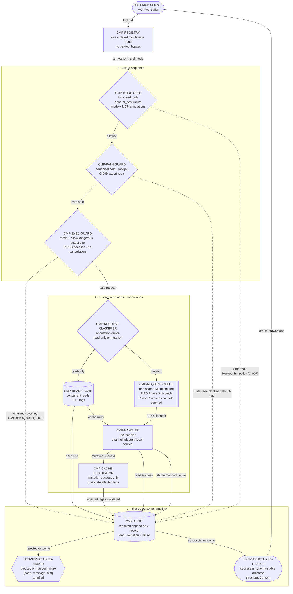

# 07 — Centralized Policy Pipeline

## Purpose

This activity-like view defines the one registry middleware path every tool call must traverse. It separates the guarded read and mutation lanes, shows their distinct cache and queue controls, and makes audit plus stable result mapping the shared outcome boundary. Individual handlers do not own or bypass these cross-cutting controls.

## Source baseline

- Archive: `C:\Users\dasbl\Downloads\files.zip`
- SHA-256: `0B78D0AC0B0676AEFD31A394ADBB95980B6AC2A6273246840325633CB1F96229`
- Central middleware, modes, classification, queue, cache, audit, and errors: `phase-07-hardening-safety-concurrency-observability.md` — §§1–9.
- Canonical project-root path jail and export-path ambiguity: `phase-06-batch-filesystem-and-assets.md` — §§5–9.
- Arbitrary editor-script execution guard: `phase-02-introspection-and-universal-primitive.md` — §§2, 4–9.
- Source conflicts and missing consistency contracts: [Open-question register](open-questions.md#architecture-open-questions), especially [Q-006](open-questions.md#architecture-open-questions), [Q-007](open-questions.md#architecture-open-questions), [Q-008](open-questions.md#architecture-open-questions), and [Q-009](open-questions.md#architecture-open-questions).

## Normative policy activity

## Node outline

The node inventory is exhaustive for this view and indexed in the [Traceability index](traceability.md#architecture-atlas-traceability). Source gaps remain explicit in the [Open-question register](open-questions.md#architecture-open-questions).

| Node | Responsibility | Evidence | Phase owner | Protocol / boundary | Source / trace / open questions |
|---|---|---|---|---|---|
| `CNT-MCP-CLIENT` | Sends a tool call and receives a schema-stable result or error outcome. | Explicit | Consumer integration | MCP over stdio at the public control-plane boundary. | Phase 1 §4 · [trace](traceability.md#architecture-atlas-traceability) |
| `CMP-REGISTRY` | Wraps every registered tool in one ordered middleware band so no handler can bypass policy. | Explicit | Phase 7 | `server/registry.ts` registry-assembly boundary. | Phase 7 §§3–6 · [trace](traceability.md#architecture-atlas-traceability) |
| `CMP-MODE-GATE` | Resolves `full`, `read_only`, or `confirm_destructive` and evaluates MCP annotations plus confirmation. | Explicit | Phase 7 | `mw/safety.ts` mode and annotation policy boundary. | Phase 7 §§2, 5, 7–8 · [Q-006](open-questions.md#architecture-open-questions) · [trace](traceability.md#architecture-atlas-traceability) |
| `CMP-PATH-GUARD` | Canonicalizes guarded paths, enforces the project-root jail, and rejects traversal or disallowed roots. | Explicit | Phases 6 and 7 | `FsGuard` canonical filesystem/export boundary. | Phase 6 §§5–9; Phase 7 §§1–4 · [Q-009](open-questions.md#architecture-open-questions) · [trace](traceability.md#architecture-atlas-traceability) |
| `CMP-EXEC-GUARD` | Applies source-independent mode plus per-call `allowDangerous:true`, output bounds, and the TypeScript-owned 15-second response deadline. It makes no in-process cancellation claim. | Explicit | Phases 2 and 7 | `exec/guard.ts` and TypeScript bridge timeout boundary. | ADR 0002; Phase 2 §§2, 4–9; Phase 7 §§1–8 · [trace](traceability.md#architecture-atlas-traceability) |
| `CMP-REQUEST-CLASSIFIER` | Uses annotations and mutation metadata to select the concurrent read lane or serialized mutation lane. | Explicit | Phase 7 | Registry metadata and middleware-routing boundary. | Phase 7 §§1–8 · [Q-006](open-questions.md#architecture-open-questions) · [Q-008](open-questions.md#architecture-open-questions) · [trace](traceability.md#architecture-atlas-traceability) |
| `CMP-READ-CACHE` | Serves only read-only requests from a keyed TTL cache and tags entries for later invalidation. | Explicit | Phase 7 | `mw/cache.ts` concurrent read-cache boundary. | Phase 7 §§2, 4–9 · [Q-008](open-questions.md#architecture-open-questions) · [trace](traceability.md#architecture-atlas-traceability) |
| `CMP-REQUEST-QUEUE` | Serializes mutations in one FIFO lane with timeout, fairness, backpressure, and watchdog controls. | Explicit | Phase 7 | `mw/queue.ts` in-process mutation scheduling boundary. | Phase 7 §§2, 4–9 · [Q-008](open-questions.md#architecture-open-questions) · [trace](traceability.md#architecture-atlas-traceability) |
| `CMP-HANDLER` | Invokes the selected tool implementation, channel adapter, or local service after centralized controls pass. | Explicit | Phases 1–7 | Tool-handler and execution-channel boundary. | Phase 7 §§3–6 · [trace](traceability.md#architecture-atlas-traceability) |
| `CMP-CACHE-INVALIDATOR` | Invalidates affected scene-tree, project-setting, or resource tags after confirmed mutation success. | Explicit | Phase 7 | `Cache.invalidate(tags)` post-mutation boundary. | Phase 7 §§4–8 · [Q-008](open-questions.md#architecture-open-questions) · [trace](traceability.md#architecture-atlas-traceability) |
| `CMP-AUDIT` | Finalizes one redacted append-only record for cached reads, handler reads, mutations, rejections, and mapped failures. | Explicit | Phase 7 | `obs/audit.ts` stderr/file observability boundary; never MCP stdout. | Phase 7 §§2–6, 9 · [Q-007](open-questions.md#architecture-open-questions) · [trace](traceability.md#architecture-atlas-traceability) |
| `SYS-STRUCTURED-RESULT` | Holds the successful schema-stable outcome returned as MCP `structuredContent`. | Explicit | Phases 1 and 7 | MCP structured-result boundary after audit consequences settle. | Phase 1 §4; Phase 7 §§4, 8 · [trace](traceability.md#architecture-atlas-traceability) |
| `SYS-STRUCTURED-ERROR` | Terminates rejected or failed paths with `{code, message, hint}`. | Explicit | Phase 7 | Stable MCP error-mapping boundary. | Phase 7 §§2, 4, 6–8 · [Q-007](open-questions.md#architecture-open-questions) · [trace](traceability.md#architecture-atlas-traceability) |

## Relationship outline

| Flow | From → To | Message / outcome | Evidence | Phase / protocol | Source / trace |
|---|---|---|---|---|---|
| `FLOW-POL-001` | `CNT-MCP-CLIENT` → `CMP-REGISTRY` | Submit one tool call. | Explicit | Phase 1 / MCP tool call over stdio | Phase 1 §4 · [trace](traceability.md#architecture-atlas-traceability) |
| `FLOW-POL-002` | `CMP-REGISTRY` → `CMP-MODE-GATE` | Supply tool annotations, configured mode, and arguments. | Explicit | Phase 7 / registry middleware context | Phase 7 §§3–7 · [trace](traceability.md#architecture-atlas-traceability) |
| `FLOW-POL-003` | `CMP-MODE-GATE` → `CMP-PATH-GUARD` | Continue an annotation- and mode-allowed call. | Explicit | Phase 7 / mode and annotation policy | Phase 7 §§2, 4–8 · [trace](traceability.md#architecture-atlas-traceability) |
| `FLOW-POL-004` | `CMP-PATH-GUARD` → `CMP-EXEC-GUARD` | Continue after canonical path validation. | Explicit | Phases 6 and 7 / `FsGuard` path contract | Phase 6 §§5–9; Phase 7 §§1–4 · [Q-009](open-questions.md#architecture-open-questions) · [trace](traceability.md#architecture-atlas-traceability) |
| `FLOW-POL-005` | `CMP-MODE-GATE` → `CMP-AUDIT` | Record `«inferred» blocked_by_policy` rejection. | Inferred | Phase 7 / rejected-call audit finalization | Phase 7 §§4–5 · [Q-007](open-questions.md#architecture-open-questions) · [trace](traceability.md#architecture-atlas-traceability) |
| `FLOW-POL-006` | `CMP-PATH-GUARD` → `CMP-AUDIT` | Record an `«inferred»` blocked path. | Inferred | Phases 6 and 7 / guarded-path rejection audit | Phase 6 §§5–9; Phase 7 §§4–5 · [Q-007](open-questions.md#architecture-open-questions) · [Q-009](open-questions.md#architecture-open-questions) · [trace](traceability.md#architecture-atlas-traceability) |
| `FLOW-POL-007` | `CMP-EXEC-GUARD` → `CMP-AUDIT` | Record an `«inferred»` blocked execution. | Inferred | Phases 2 and 7 / exec-guard rejection audit | Phase 2 §§4–9; Phase 7 §§4–7 · [Q-006](open-questions.md#architecture-open-questions) · [Q-007](open-questions.md#architecture-open-questions) · [trace](traceability.md#architecture-atlas-traceability) |
| `FLOW-POL-008` | `CMP-AUDIT` → `SYS-STRUCTURED-ERROR` | Map a rejected outcome to `{code, message, hint}` and terminate the branch. | Explicit | Phase 7 / stable structured error mapping | Phase 7 §§2, 4, 6–8 · [Q-007](open-questions.md#architecture-open-questions) · [trace](traceability.md#architecture-atlas-traceability) |
| `FLOW-POL-009` | `CMP-EXEC-GUARD` → `CMP-REQUEST-CLASSIFIER` | Classify a safe request. | Explicit | Phase 7 / registry classifier handoff | Phase 7 §§4–8 · [Q-006](open-questions.md#architecture-open-questions) · [trace](traceability.md#architecture-atlas-traceability) |
| `FLOW-POL-010` | `CMP-REQUEST-CLASSIFIER` → `CMP-READ-CACHE` | Route a read-only request to the concurrent cache lane. | Explicit | Phase 7 / annotation-driven concurrent read lane | Phase 7 §§2, 4–8 · [Q-008](open-questions.md#architecture-open-questions) · [trace](traceability.md#architecture-atlas-traceability) |
| `FLOW-POL-011` | `CMP-READ-CACHE` → `CMP-AUDIT` | Audit a TTL/tag cache hit without invoking the handler. | Explicit | Phase 7 / cached read outcome | Phase 7 §§4–8 · [Q-008](open-questions.md#architecture-open-questions) · [trace](traceability.md#architecture-atlas-traceability) |
| `FLOW-POL-012` | `CMP-READ-CACHE` → `CMP-HANDLER` | Invoke the handler after a cache miss. | Explicit | Phase 7 / read-cache fallback | Phase 7 §§4–8 · [Q-008](open-questions.md#architecture-open-questions) · [trace](traceability.md#architecture-atlas-traceability) |
| `FLOW-POL-013` | `CMP-REQUEST-CLASSIFIER` → `CMP-REQUEST-QUEUE` | Route a mutation into the single mutation lane. | Explicit | Phase 7 / annotation-driven mutation scheduling | Phase 7 §§2, 4–8 · [Q-006](open-questions.md#architecture-open-questions) · [Q-008](open-questions.md#architecture-open-questions) · [trace](traceability.md#architecture-atlas-traceability) |
| `FLOW-POL-014` | `CMP-REQUEST-QUEUE` → `CMP-HANDLER` | Dispatch one FIFO mutation under timeout, fairness, backpressure, and watchdog controls. | Explicit | Phase 7 / FIFO queue dispatch | Phase 7 §§4–9 · [Q-008](open-questions.md#architecture-open-questions) · [trace](traceability.md#architecture-atlas-traceability) |
| `FLOW-POL-015` | `CMP-HANDLER` → `CMP-CACHE-INVALIDATOR` | Send only confirmed mutation success to invalidation. | Explicit | Phase 7 / successful handler outcome | Phase 7 §§4–8 · [Q-008](open-questions.md#architecture-open-questions) · [trace](traceability.md#architecture-atlas-traceability) |
| `FLOW-POL-016` | `CMP-CACHE-INVALIDATOR` → `CMP-AUDIT` | Audit after affected cache tags are invalidated. | Explicit | Phase 7 / tag invalidation and mutation audit | Phase 7 §§4–8 · [Q-008](open-questions.md#architecture-open-questions) · [trace](traceability.md#architecture-atlas-traceability) |
| `FLOW-POL-017` | `CMP-HANDLER` → `CMP-AUDIT` | Audit a successful uncached read. | Explicit | Phase 7 / read outcome audit | Phase 7 §§4–6 · [trace](traceability.md#architecture-atlas-traceability) |
| `FLOW-POL-018` | `CMP-HANDLER` → `CMP-AUDIT` | Audit a stable mapped handler failure. | Explicit | Phase 7 / failure outcome audit | Phase 7 §§2, 4–8 · [Q-007](open-questions.md#architecture-open-questions) · [trace](traceability.md#architecture-atlas-traceability) |
| `FLOW-POL-019` | `CMP-AUDIT` → `SYS-STRUCTURED-RESULT` | Map a successful cached read, handler read, or invalidated mutation outcome. | Explicit | Phase 7 / structured success mapping | Phase 7 §§4–8 · [trace](traceability.md#architecture-atlas-traceability) |
| `FLOW-POL-020` | `SYS-STRUCTURED-RESULT` → `CNT-MCP-CLIENT` | Return MCP `structuredContent`. | Explicit | Phases 1 and 7 / MCP structured result | Phase 1 §4; Phase 7 §§4, 8 · [trace](traceability.md#architecture-atlas-traceability) |

## Policy, concurrency, and consistency risks

- For arbitrary editor-script execution, `read_only` and `confirm_destructive` block; `full` additionally requires `allowDangerous:true` on every call. Authorization is source-independent: regexes, deny-lists, and source heuristics are not a security boundary. [Q-006](open-questions.md#architecture-open-questions) separately tracks headless GDScript classification.
- `CMP-PATH-GUARD` preserves the canonical project-root jail. Allowed export output paths remain unresolved under [Q-009](open-questions.md#architecture-open-questions); the allowed branch does not silently authorize a temp or external root.
- `CMP-EXEC-GUARD` applies the mode/capability gate and output cap. TypeScript owns the 15-second response timeout; a blocked Godot editor thread is not cancelled in-process and may require an editor restart. A guard rejection maps to `blocked_by_policy` and the structured-error fields `{code, message, hint}`.
- The queue is not a rollback transaction. FIFO serialization controls when mutations start; undo, compensation, and partial-failure semantics remain the handler's channel-specific responsibility.
- Concurrent reads may observe in-progress mutation state. Reads intentionally proceed during a long mutation, while TTL and affected-tag invalidation happen outside a snapshot-isolation contract; [Q-008](open-questions.md#architecture-open-questions) tracks cached pre-state, partial live state, and stale repopulation risks.
- FIFO, timeout, fairness, backpressure, and watchdog are queue liveness controls. They do not guarantee rollback, atomicity, or read consistency.
- The three dashed rejection edges are **«inferred»** from the requirement for an append-only record of every tool call. The source diagram exits directly on a block, so rejected-call audit coverage remains open under [Q-007](open-questions.md#architecture-open-questions).
- Cached reads, uncached reads, and successful mutations converge through `CMP-AUDIT` before `structuredContent`. Rejections and stable mapped failures also reach audit, then terminate at `SYS-STRUCTURED-ERROR`; no success edge leaves that terminal node.
