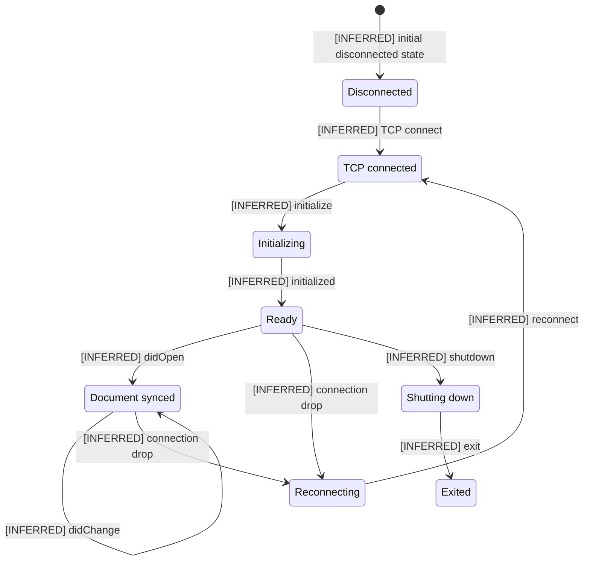
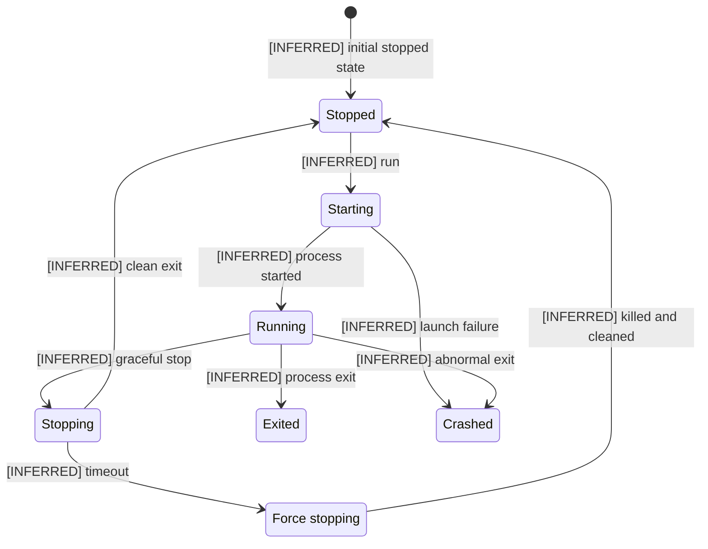
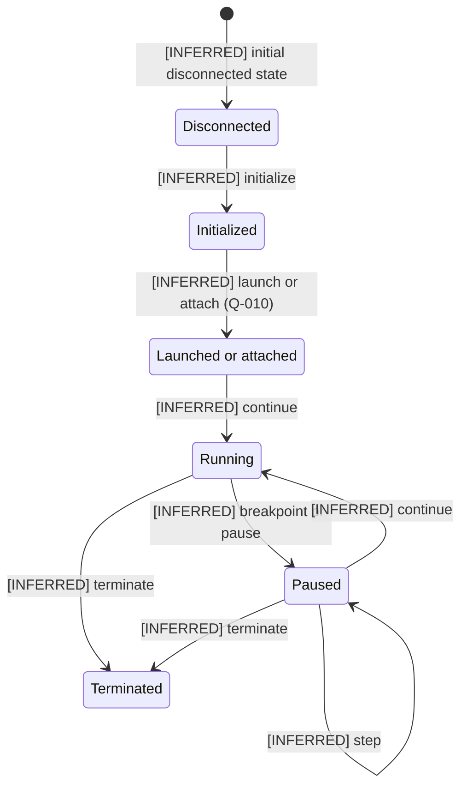

# 08 — Transport and Runtime Lifecycles

## Purpose

These four state views isolate the independently recoverable lifecycles behind editor transport, Godot LSP document synchronization, the managed game process, and Godot DAP. The WebSocket state machine is source-defined. The LSP, process, and DAP state partitions are explicitly marked as inferred projections of source-defined operations; they do not claim that the source declares equivalent state machines.

## Source baseline

- Archive: `C:\Users\dasbl\Downloads\files.zip`
- SHA-256: `0B78D0AC0B0676AEFD31A394ADBB95980B6AC2A6273246840325633CB1F96229`
- Editor WebSocket connection, heartbeat, and retry behavior: `phase-01-foundation-and-transport.md` — §§4–6 and 8–9.
- LSP TCP, handshake, document synchronization, reconnect, and shutdown operations: `phase-04-code-intelligence-lsp.md` — §§2, 4, and 6–9.
- Process and DAP operations, stop escalation, cleanup, and launch ambiguity: `phase-05-runtime-and-debug.md` — §§2 and 4–9.
- Unresolved heartbeat mechanics and DAP launch ownership: [Open-question register](open-questions.md#architecture-open-questions), especially [Q-003](open-questions.md#architecture-open-questions) and [Q-010](open-questions.md#architecture-open-questions).

## Editor WebSocket transport lifecycle

```mermaid
stateDiagram-v2
  accTitle: Editor WebSocket transport lifecycle
  accDescr: The TypeScript WebSocket client starts disconnected, opens a localhost editor connection, and enters connected service. Initial connection failure, socket close, or a missed heartbeat enters reconnecting; exponential backoff returns it to a fresh connection attempt. Q-003 leaves the heartbeat frame and ownership details unresolved.
  direction LR

  %% atlas-node: STATE-WS-DISCONNECTED
  state "Disconnected" as WS_DISCONNECTED
  %% atlas-node: STATE-WS-CONNECTING
  state "Connecting" as WS_CONNECTING
  %% atlas-node: STATE-WS-CONNECTED
  state "Connected" as WS_CONNECTED
  %% atlas-node: STATE-WS-RECONNECTING
  state "Reconnecting" as WS_RECONNECTING

  %% atlas-flow: FLOW-WS-001
  [*] --> WS_DISCONNECTED
  %% atlas-flow: FLOW-WS-002
  WS_DISCONNECTED --> WS_CONNECTING : start
  %% atlas-flow: FLOW-WS-003
  WS_CONNECTING --> WS_CONNECTED : socket open
  %% atlas-flow: FLOW-WS-004
  WS_CONNECTING --> WS_RECONNECTING : connection failure
  %% atlas-flow: FLOW-WS-005
  WS_CONNECTED --> WS_RECONNECTING : close or missed heartbeat (Q-003)
  %% atlas-flow: FLOW-WS-006
  WS_RECONNECTING --> WS_CONNECTING : backoff elapsed
```

**Source status.** Phase 1 explicitly assigns connection state, heartbeat detection, reconnect ownership, and exponential backoff to the TypeScript WebSocket client. [Q-003](open-questions.md#architecture-open-questions) keeps the heartbeat transport, initiator, and timeout mechanics unresolved without weakening the explicit missed-heartbeat recovery transition.

**Operational invariant.** Editor JSON-RPC work is available only in `STATE-WS-CONNECTED`. A failed open, closed socket, or missed heartbeat cannot continue serving calls; recovery re-enters `STATE-WS-CONNECTING` only after the source-defined exponential backoff delay.

### State outline

| State | Meaning | Evidence | Phase owner | Protocol / boundary | Source / trace / open questions |
|---|---|---|---|---|---|
| `STATE-WS-DISCONNECTED` | No usable editor WebSocket exists before startup. | Explicit | Phase 1 | `bridge/ws-client.ts` connection boundary. | Phase 1 §§4–6 · [trace](traceability.md#architecture-atlas-traceability) |
| `STATE-WS-CONNECTING` | The client is attempting to open the localhost editor socket. | Explicit | Phase 1 | WebSocket open to the plugin listener on the configured editor port. | Phase 1 §§4–6 · [trace](traceability.md#architecture-atlas-traceability) |
| `STATE-WS-CONNECTED` | The socket is open and correlated JSON-RPC calls may cross the editor boundary. | Explicit | Phase 1 | WebSocket plus JSON-RPC 2.0 on localhost. | Phase 1 §§4–6 · [Q-003](open-questions.md#architecture-open-questions) · [trace](traceability.md#architecture-atlas-traceability) |
| `STATE-WS-RECONNECTING` | The client owns delayed recovery after a failed open, close, or missed heartbeat. | Explicit | Phase 1 | Client-side exponential retry timer and editor transport lifecycle. | Phase 1 §§5–6, 8–9 · [Q-003](open-questions.md#architecture-open-questions) · [trace](traceability.md#architecture-atlas-traceability) |

### Transition outline

| Flow | From → To | Trigger / outcome | Evidence | Phase owner | Protocol / boundary | Source / trace / open questions |
|---|---|---|---|---|---|---|
| `FLOW-WS-001` | `[*]` → `STATE-WS-DISCONNECTED` | Establish the explicit initial connection state. | Explicit | Phase 1 | In-process WebSocket client lifecycle. | Phase 1 §§4–6 · [trace](traceability.md#architecture-atlas-traceability) |
| `FLOW-WS-002` | `STATE-WS-DISCONNECTED` → `STATE-WS-CONNECTING` | Start the editor transport. | Explicit | Phase 1 | WebSocket client open attempt. | Phase 1 §§4–6 · [trace](traceability.md#architecture-atlas-traceability) |
| `FLOW-WS-003` | `STATE-WS-CONNECTING` → `STATE-WS-CONNECTED` | Socket open completes successfully. | Explicit | Phase 1 | Local WebSocket handshake. | Phase 1 §§4–6, 8 · [trace](traceability.md#architecture-atlas-traceability) |
| `FLOW-WS-004` | `STATE-WS-CONNECTING` → `STATE-WS-RECONNECTING` | A connection attempt fails. | Explicit | Phase 1 | Client connection-error boundary. | Phase 1 §§5–6, 8–9 · [trace](traceability.md#architecture-atlas-traceability) |
| `FLOW-WS-005` | `STATE-WS-CONNECTED` → `STATE-WS-RECONNECTING` | A socket close or missed heartbeat removes liveness. | Explicit | Phase 1 | WebSocket liveness and reconnect boundary. | Phase 1 §§5–6, 8–9 · [Q-003](open-questions.md#architecture-open-questions) · [trace](traceability.md#architecture-atlas-traceability) |
| `FLOW-WS-006` | `STATE-WS-RECONNECTING` → `STATE-WS-CONNECTING` | The current backoff delay elapses. | Explicit | Phase 1 | Exponential reconnect timer. | Phase 1 §§5–6, 8–9 · [trace](traceability.md#architecture-atlas-traceability) |

## Godot LSP document lifecycle

**Source status.** Phase 4 explicitly specifies TCP connection, LSP initialization, document notifications, reconnect behavior, shutdown, and exit operations. It does not declare these eight states or this state machine, so every state and transition is an **[INFERRED]** projection of those operations.

**Operational invariant.** `didOpen` follows a completed initialize/initialized handshake, and `didChange` preserves a synchronized open document. A dropped ready or synchronized connection enters recovery; graceful termination follows `shutdown` then `exit` without inventing additional transitions.

### State outline

| State | Meaning | Evidence | Phase owner | Protocol / boundary | Source / trace / open questions |
|---|---|---|---|---|---|
| `STATE-LSP-DISCONNECTED` | No active Godot LSP TCP session is available. | Inferred | Phase 4 | `lsp/client.ts` connection boundary to TCP 6005. | Phase 4 §§2, 4, 6–9 · [trace](traceability.md#architecture-atlas-traceability) |
| `STATE-LSP-TCP-CONNECTED` | TCP is open but the LSP initialize handshake has not completed. | Inferred | Phase 4 | LSP JSON-RPC framing over TCP 6005. | Phase 4 §§4, 6–8 · [trace](traceability.md#architecture-atlas-traceability) |
| `STATE-LSP-INITIALIZING` | The client has issued `initialize` and awaits the handshake completion. | Inferred | Phase 4 | LSP initialize request and initialized notification boundary. | Phase 4 §§4, 6–8 · [trace](traceability.md#architecture-atlas-traceability) |
| `STATE-LSP-READY` | Initialization is complete and the client may open a document or shut down. | Inferred | Phase 4 | Initialized LSP session before document synchronization. | Phase 4 §§2, 4, 6–8 · [trace](traceability.md#architecture-atlas-traceability) |
| `STATE-LSP-DOCUMENT-SYNCED` | A document is open and subsequent changes remain synchronized. | Inferred | Phase 4 | `textDocument/didOpen` and `textDocument/didChange` notifications. | Phase 4 §§2, 4, 6–8 · [trace](traceability.md#architecture-atlas-traceability) |
| `STATE-LSP-RECONNECTING` | The client is recovering an interrupted ready or document-synced session. | Inferred | Phase 4 | LSP TCP reconnect boundary. | Phase 4 §§6–9 · [trace](traceability.md#architecture-atlas-traceability) |
| `STATE-LSP-SHUTTING-DOWN` | A graceful `shutdown` request is in progress before `exit`. | Inferred | Phase 4 | LSP shutdown request boundary. | Phase 4 §§6–9 · [trace](traceability.md#architecture-atlas-traceability) |
| `STATE-LSP-EXITED` | The graceful LSP exit operation has completed the modeled lifecycle. | Inferred | Phase 4 | LSP exit notification and client teardown boundary. | Phase 4 §§6–9 · [trace](traceability.md#architecture-atlas-traceability) |

### Transition outline

| Flow | From → To | Trigger / outcome | Evidence | Phase owner | Protocol / boundary | Source / trace / open questions |
|---|---|---|---|---|---|---|
| `FLOW-LSP-001` | `[*]` → `STATE-LSP-DISCONNECTED` | Project the initial client condition before TCP connect. | Inferred | Phase 4 | In-process LSP client lifecycle. | Phase 4 §§4, 6–9 · [trace](traceability.md#architecture-atlas-traceability) |
| `FLOW-LSP-002` | `STATE-LSP-DISCONNECTED` → `STATE-LSP-TCP-CONNECTED` | TCP connect succeeds. | Inferred | Phase 4 | TCP 6005 connection. | Phase 4 §§4, 6–8 · [trace](traceability.md#architecture-atlas-traceability) |
| `FLOW-LSP-003` | `STATE-LSP-TCP-CONNECTED` → `STATE-LSP-INITIALIZING` | Send the LSP `initialize` request. | Inferred | Phase 4 | LSP request correlation over TCP. | Phase 4 §§4, 6–8 · [trace](traceability.md#architecture-atlas-traceability) |
| `FLOW-LSP-004` | `STATE-LSP-INITIALIZING` → `STATE-LSP-READY` | Complete the `initialized` handshake. | Inferred | Phase 4 | LSP initialized notification. | Phase 4 §§4, 6–8 · [trace](traceability.md#architecture-atlas-traceability) |
| `FLOW-LSP-005` | `STATE-LSP-READY` → `STATE-LSP-DOCUMENT-SYNCED` | Send `didOpen` for the document. | Inferred | Phase 4 | LSP text-document synchronization. | Phase 4 §§2, 4, 6–8 · [trace](traceability.md#architecture-atlas-traceability) |
| `FLOW-LSP-006` | `STATE-LSP-DOCUMENT-SYNCED` → `STATE-LSP-DOCUMENT-SYNCED` | Send `didChange` while keeping the document synchronized. | Inferred | Phase 4 | LSP text-document synchronization self-loop. | Phase 4 §§2, 4, 6–8 · [trace](traceability.md#architecture-atlas-traceability) |
| `FLOW-LSP-007` | `STATE-LSP-READY` → `STATE-LSP-RECONNECTING` | A ready connection drops. | Inferred | Phase 4 | LSP TCP failure boundary. | Phase 4 §§6–9 · [trace](traceability.md#architecture-atlas-traceability) |
| `FLOW-LSP-008` | `STATE-LSP-DOCUMENT-SYNCED` → `STATE-LSP-RECONNECTING` | A document-synced connection drops. | Inferred | Phase 4 | LSP TCP failure boundary. | Phase 4 §§6–9 · [trace](traceability.md#architecture-atlas-traceability) |
| `FLOW-LSP-009` | `STATE-LSP-RECONNECTING` → `STATE-LSP-TCP-CONNECTED` | Reconnect the TCP session. | Inferred | Phase 4 | LSP TCP recovery boundary. | Phase 4 §§6–9 · [trace](traceability.md#architecture-atlas-traceability) |
| `FLOW-LSP-010` | `STATE-LSP-READY` → `STATE-LSP-SHUTTING-DOWN` | Send `shutdown`. | Inferred | Phase 4 | LSP graceful-shutdown request. | Phase 4 §§6–9 · [trace](traceability.md#architecture-atlas-traceability) |
| `FLOW-LSP-011` | `STATE-LSP-SHUTTING-DOWN` → `STATE-LSP-EXITED` | Send `exit` after shutdown. | Inferred | Phase 4 | LSP exit and teardown boundary. | Phase 4 §§6–9 · [trace](traceability.md#architecture-atlas-traceability) |

## Managed game process lifecycle

**Source status.** Phase 5 explicitly specifies spawn, PID and output tracking, run state, graceful stop, timeout-based forced stop, exit reporting, failure, and cleanup operations. It does not declare these seven states or this state machine, so every state and transition is an **[INFERRED]** projection.

**Operational invariant.** A forced stop is a timeout escalation from an already requested graceful stop, never a parallel first choice. Clean graceful exit and killed-plus-cleaned escalation return to `STATE-PROC-STOPPED`; launch failure and unrequested terminal outcomes retain the distinct `STATE-PROC-CRASHED` or `STATE-PROC-EXITED` result required by the exact transition contract.

### State outline

| State | Meaning | Evidence | Phase owner | Protocol / boundary | Source / trace / open questions |
|---|---|---|---|---|---|
| `STATE-PROC-STOPPED` | No managed game process is active and stop cleanup has settled. | Inferred | Phase 5 | `runtime/process.ts` child-process ownership boundary. | Phase 5 §§2, 4–9 · [trace](traceability.md#architecture-atlas-traceability) |
| `STATE-PROC-STARTING` | ProcessRunner is attempting the source-defined Godot spawn. | Inferred | Phase 5 | Local OS spawn for `godot --path <project> [scene]`. | Phase 5 §§2, 4, 6–9 · [trace](traceability.md#architecture-atlas-traceability) |
| `STATE-PROC-RUNNING` | The managed child is active with PID and bounded output tracking. | Inferred | Phase 5 | Child PID plus stdout and stderr ring-buffer boundary. | Phase 5 §§2, 4–9 · [trace](traceability.md#architecture-atlas-traceability) |
| `STATE-PROC-STOPPING` | Graceful termination has been requested and is awaiting clean exit. | Inferred | Phase 5 | ProcessRunner graceful-stop boundary. | Phase 5 §§6, 8–9 · [trace](traceability.md#architecture-atlas-traceability) |
| `STATE-PROC-EXITED` | A running child reported the modeled process-exit outcome. | Inferred | Phase 5 | Child-process exit-status boundary. | Phase 5 §§4, 6–9 · [trace](traceability.md#architecture-atlas-traceability) |
| `STATE-PROC-CRASHED` | Spawn failed or a running child ended abnormally. | Inferred | Phase 5 | Launch and abnormal-exit error boundary. | Phase 5 §§4, 6, 8–9 · [trace](traceability.md#architecture-atlas-traceability) |
| `STATE-PROC-FORCE-STOPPING` | Graceful stop timed out and ProcessRunner is forcing termination and cleanup. | Inferred | Phase 5 | Forced kill and orphan-cleanup boundary. | Phase 5 §§6, 8–9 · [trace](traceability.md#architecture-atlas-traceability) |

### Transition outline

| Flow | From → To | Trigger / outcome | Evidence | Phase owner | Protocol / boundary | Source / trace / open questions |
|---|---|---|---|---|---|---|
| `FLOW-PROC-001` | `[*]` → `STATE-PROC-STOPPED` | Project the initial no-process condition. | Inferred | Phase 5 | In-process ProcessRunner lifecycle. | Phase 5 §§4, 6–9 · [trace](traceability.md#architecture-atlas-traceability) |
| `FLOW-PROC-002` | `STATE-PROC-STOPPED` → `STATE-PROC-STARTING` | Receive the run operation. | Inferred | Phase 5 | Runtime tool to ProcessRunner dispatch. | Phase 5 §§2, 4, 6 · [trace](traceability.md#architecture-atlas-traceability) |
| `FLOW-PROC-003` | `STATE-PROC-STARTING` → `STATE-PROC-RUNNING` | The child process starts successfully. | Inferred | Phase 5 | Local child-process spawn. | Phase 5 §§4, 6–8 · [trace](traceability.md#architecture-atlas-traceability) |
| `FLOW-PROC-004` | `STATE-PROC-STARTING` → `STATE-PROC-CRASHED` | Launch fails. | Inferred | Phase 5 | Spawn-error mapping boundary. | Phase 5 §§4, 6, 8–9 · [trace](traceability.md#architecture-atlas-traceability) |
| `FLOW-PROC-005` | `STATE-PROC-RUNNING` → `STATE-PROC-STOPPING` | Request graceful stop. | Inferred | Phase 5 | Managed process termination. | Phase 5 §§6, 8–9 · [trace](traceability.md#architecture-atlas-traceability) |
| `FLOW-PROC-006` | `STATE-PROC-STOPPING` → `STATE-PROC-STOPPED` | The process exits cleanly. | Inferred | Phase 5 | Graceful exit and cleanup boundary. | Phase 5 §§6, 8–9 · [trace](traceability.md#architecture-atlas-traceability) |
| `FLOW-PROC-007` | `STATE-PROC-STOPPING` → `STATE-PROC-FORCE-STOPPING` | The graceful-stop timeout expires. | Inferred | Phase 5 | Stop timeout and escalation boundary. | Phase 5 §§6, 8–9 · [trace](traceability.md#architecture-atlas-traceability) |
| `FLOW-PROC-008` | `STATE-PROC-FORCE-STOPPING` → `STATE-PROC-STOPPED` | The child is killed and cleanup completes. | Inferred | Phase 5 | Forced kill and orphan-PID cleanup. | Phase 5 §§6, 8–9 · [trace](traceability.md#architecture-atlas-traceability) |
| `FLOW-PROC-009` | `STATE-PROC-RUNNING` → `STATE-PROC-EXITED` | The managed child reports process exit. | Inferred | Phase 5 | Child exit-status boundary. | Phase 5 §§4, 6–9 · [trace](traceability.md#architecture-atlas-traceability) |
| `FLOW-PROC-010` | `STATE-PROC-RUNNING` → `STATE-PROC-CRASHED` | The managed child exits abnormally. | Inferred | Phase 5 | Abnormal child-exit boundary. | Phase 5 §§4, 6, 8–9 · [trace](traceability.md#architecture-atlas-traceability) |

## Godot DAP session lifecycle

**Source status.** Phase 5 explicitly specifies DAP framing, initialization, launch or attach capability, continue, pause, breakpoint, step, inspection, termination, and cleanup operations. It does not declare these six states or this state machine, so every state and transition is an **[INFERRED]** projection; [Q-010](open-questions.md#architecture-open-questions) remains unresolved.

**Operational invariant.** Execution controls follow initialization and a launch-or-attach operation. Continue enters running, a breakpoint or pause enters paused, step preserves paused state, and terminate ends either running or paused execution; the view neither selects launch ownership nor adds a second process.

### State outline

| State | Meaning | Evidence | Phase owner | Protocol / boundary | Source / trace / open questions |
|---|---|---|---|---|---|
| `STATE-DAP-DISCONNECTED` | No initialized DAP session is available. | Inferred | Phase 5 | `runtime/dap-client.ts` TCP client boundary to port 6006. | Phase 5 §§2, 4, 6–9 · [trace](traceability.md#architecture-atlas-traceability) |
| `STATE-DAP-INITIALIZED` | The DAP initialize handshake has completed before launch or attach. | Inferred | Phase 5 | DAP request framing and capability handshake. | Phase 5 §§4, 6–8 · [trace](traceability.md#architecture-atlas-traceability) |
| `STATE-DAP-LAUNCHED-ATTACHED` | A launch-or-attach operation has established the debug target without choosing its owner. | Inferred | Phase 5 | DAP launch or attach boundary. | Phase 5 §§2, 4, 6 · [Q-010](open-questions.md#architecture-open-questions) · [trace](traceability.md#architecture-atlas-traceability) |
| `STATE-DAP-RUNNING` | The debug target is executing after continue. | Inferred | Phase 5 | DAP execution-control boundary. | Phase 5 §§2, 4, 6–8 · [trace](traceability.md#architecture-atlas-traceability) |
| `STATE-DAP-PAUSED` | The target is stopped at a breakpoint, explicit pause, or completed step. | Inferred | Phase 5 | DAP stopped-event and execution-control boundary. | Phase 5 §§2, 4, 6–8 · [trace](traceability.md#architecture-atlas-traceability) |
| `STATE-DAP-TERMINATED` | A terminate operation has ended the modeled debug session. | Inferred | Phase 5 | DAP termination and client-teardown boundary. | Phase 5 §§6–9 · [trace](traceability.md#architecture-atlas-traceability) |

### Transition outline

| Flow | From → To | Trigger / outcome | Evidence | Phase owner | Protocol / boundary | Source / trace / open questions |
|---|---|---|---|---|---|---|
| `FLOW-DAP-001` | `[*]` → `STATE-DAP-DISCONNECTED` | Project the initial no-session condition. | Inferred | Phase 5 | In-process DAP client lifecycle. | Phase 5 §§4, 6–9 · [trace](traceability.md#architecture-atlas-traceability) |
| `FLOW-DAP-002` | `STATE-DAP-DISCONNECTED` → `STATE-DAP-INITIALIZED` | Complete DAP initialize. | Inferred | Phase 5 | DAP handshake over TCP 6006. | Phase 5 §§4, 6–8 · [trace](traceability.md#architecture-atlas-traceability) |
| `FLOW-DAP-003` | `STATE-DAP-INITIALIZED` → `STATE-DAP-LAUNCHED-ATTACHED` | Perform launch or attach without selecting ownership. | Inferred | Phase 5 | DAP launch-or-attach boundary. | Phase 5 §§2, 4, 6 · [Q-010](open-questions.md#architecture-open-questions) · [trace](traceability.md#architecture-atlas-traceability) |
| `FLOW-DAP-004` | `STATE-DAP-LAUNCHED-ATTACHED` → `STATE-DAP-RUNNING` | Continue target execution. | Inferred | Phase 5 | DAP execution-control request. | Phase 5 §§2, 4, 6–8 · [trace](traceability.md#architecture-atlas-traceability) |
| `FLOW-DAP-005` | `STATE-DAP-RUNNING` → `STATE-DAP-PAUSED` | A breakpoint or explicit pause stops execution. | Inferred | Phase 5 | DAP stopped event or pause request. | Phase 5 §§2, 4, 6–8 · [trace](traceability.md#architecture-atlas-traceability) |
| `FLOW-DAP-006` | `STATE-DAP-PAUSED` → `STATE-DAP-RUNNING` | Continue from pause. | Inferred | Phase 5 | DAP continue request. | Phase 5 §§2, 4, 6–8 · [trace](traceability.md#architecture-atlas-traceability) |
| `FLOW-DAP-007` | `STATE-DAP-PAUSED` → `STATE-DAP-PAUSED` | Step and remain paused at the next stop. | Inferred | Phase 5 | DAP step request and stopped event. | Phase 5 §§2, 4, 6–8 · [trace](traceability.md#architecture-atlas-traceability) |
| `FLOW-DAP-008` | `STATE-DAP-RUNNING` → `STATE-DAP-TERMINATED` | Terminate a running session. | Inferred | Phase 5 | DAP termination boundary. | Phase 5 §§6–9 · [trace](traceability.md#architecture-atlas-traceability) |
| `FLOW-DAP-009` | `STATE-DAP-PAUSED` → `STATE-DAP-TERMINATED` | Terminate a paused session. | Inferred | Phase 5 | DAP termination boundary. | Phase 5 §§6–9 · [trace](traceability.md#architecture-atlas-traceability) |
